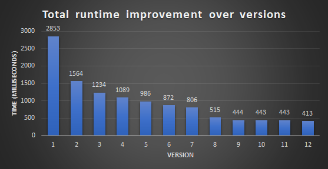

⏱️ Estimated reading time: 3 hours (may vary depending on technical familiarity).  

## Overview

This repository contains the top-performing submission for Task 4 (“Fast Row-Column Exchange”) from the 4th Global Data Compression Competition (GDCC) 2024–2025.

The task involves transposing 16-bit image matrices as fast as possible.

This guide is designed for programming students and developers, breaking down the optimization process step by step.

**What you’ll learn – in a nutshell:**
- Strategies for optimizing and vectorizing transposition for different matrix types
- Methods to minimize I/O overhead
- Some examples of how to analyze and tune C code for better assembly output

> [!IMPORTANT]
> Reading the code alone isn’t enough – you need to understand how to get there.
> In the following chapters I’ve compiled all the hints and clues you’ll need.
> Every small detail matters, and each decision you make will ultimately determine your solution’s performance.

### TL;DR

This chapter offers a high-level summary for readers already familiar with low-level optimization and systems programming.

If you’re not yet comfortable with the terminology or techniques here, don’t worry – everything is explained thoroughly in the main content.

#### General

#### Language

C, with direct Linux kernel syscalls to eliminate libc overhead.

#### Algorithm

Transposition is performed along 3 code paths depending on the matrix type:

- **For square matrices where width is divisible by 8 (Type-1):**  
   In-place transposition using SSE2 for 8×8 blocks
- **For square matrices where width is not divisible by 8 (Type-2):**  
   Same as Type-1, with scalar code for the remaining pixels.
- **For Rectangular matrices (Type-3):**  
   Out-of-place transposition using SSE2 for 8×8 blocks and scalar code for the remaining pixels.
 
#### I/O strategy

- **For in-place transposition:**  
  Memory map (`mmap`) the output file, then read the input file using traditional file I/O (`read()`) into this mapped region; transpose in-place there.
- **For out-of-place:**  
  Memory map (`mmap`) both the input and the output files. Transpose by reading the input area sequentially (row-wise) and write the output in a strided pattern (column-wise).

#### Optimizations

- **No libc** to decrease startup time and eliminate its I/O overhead.
- **SSE2** for vectorized transposition.
- **High-precision timing** to guide optimization efforts.
- **Manual tuning the C source** to guide the compiler to output faster code.

For details, see the source code files.

And now, let’s get started with the details!

## Task Definition (copied from GDCC)

Let’s see what the challenge is about.  

> Student tasks are open only to students enrolled in formal studies up to the PhD level. The organization may request proof of studentship to validate any submission in this category set. Student task list only contains one task.
> 
> ## Task 4 – Fast ROW-COLUMN EXCHANGE
> ### Task definition
> The goal of this task is to provide an executable that can exchange image matrix row and column fast.
> 
> ### Submission format
> The submission must contain two executables, transposer and detransposer, which accept the following syntax:
> 
> - transpose <input_path> <transposed_path>
> - detranspose <transposed_path> <reconstructed_path>
> where:
> - <input_path> is the path to the file to be transposed,
> - <transposed_path> is the path to the file where the transposed data are stored,
> - <reconstructed_path> is the path to the file where the reconstructed image data are stored.
> Notes:
> - <input_path> will point to .matrix format image files.
> - The reconstructed data generated in <reconstructed_path> must be the exact same .matrix image file that was input to the transposer.
>  
> ### Test dataset
> The .matrix format image data will be employed for this task; .matrix format image has the following structure:
> ```
> |image_width(4bytes)|image_height(4bytes)|image_width * image_height pixels (2 bytes per pixel)|
> 8 <= image_width, image_height <= 2048
> 0 <= pixel_value <= 65535
> ```
> ### Submission evaluation
> This task is not a compression task, we will only evaluate the transpose speed and de-transpose speed.
> 
> A single category is defined for this task. Prizes will be awarded to the 1st, 2nd, 3rd and 4th (5 prizes for the 4th position) best submissions.
> 
> Submissions must meet the following requirements to be considered valid:
> 
> - Average transposer + de-transposer time: at most 0,2 s.
> - Submissions will be assigned a score based exclusively on the transpose speed and the de-transpose speed tested on the Evaluation platform.

### Final ranking

Below are the final results published on the GDCC website (June 10th, 2025):


The last row in the table (“NumpyTranspose”) is the baseline.  
All valid submissions were required to outperform this reference implementation (i.e., complete in under 0.2 seconds).

The top-ranked entry (BruderholzByGotthardtZnonstudent) is the submission documented in this guide.  
Note: as a non-student entry, it was not eligible for a prize.

#### Clarification on column names

The `c_time` and `d_time` columns were intended for compression tasks and refer to the times required for compression and decompression (“c” and “d”).  
This is a small mistake. For this task, a more accurate name could have been `transpose time`, and a single timing column would have sufficed – since the algorithm is symmetric for both “transpose” and “detranspose” operations.

#### Score calculation

- `Full time` = `c_time` + `d_time` (i.e., “transpose” time + “detranspose” time).
- The score is based on the `Full time`.
- Lower score -> better performance -> higher ranking.

## Matrix transposition

Transposing a matrix means swapping its rows and columns – the element at position (i, j) moves to position (j, i).  
Rows become columns, and columns become rows.  
This is equivalent to flipping the matrix over its main diagonal.

A key property of transposition is that applying it twice returns the original matrix:  
(Aᵗ)ᵗ = A

```
Rectangular matrix:
 Original 3×2 matrix (A):      Transposed 2×3 matrix (Aᵗ):    Transposed again (Aᵗᵗ = A):
                                                              (back to original)
  ┌───┬───┐                    ┌───┬───┬───┐                  ┌───┬───┐
  │ 1 │ 2 │                    │ 1 │ 3 │ 5 │                  │ 1 │ 2 │
  ├───┼───┤     ────────►      ├───┼───┼───┤    ────────►     ├───┼───┤
  │ 3 │ 4 │                    │ 2 │ 4 │ 6 │                  │ 3 │ 4 │
  ├───┼───┤                    └───┴───┴───┘                  ├───┼───┤
  │ 5 │ 6 │                                                   │ 5 │ 6 │
  └───┴───┘                                                   └───┴───┘
    (3×2)                          (2×3)                        (3×2)
```
```
Square matrix:
 Original 3×3 matrix (A):      Transposed matrix (Aᵗ):        Transposed again (Aᵗᵗ = A):
                                                              (back to original)
  ┌───┬───┬───┐                ┌───┬───┬───┐                  ┌───┬───┬───┐
  │ 1 │ 2 │ 3 │                │ 1 │ 4 │ 7 │                  │ 1 │ 2 │ 3 │
  ├───┼───┼───┤    ────────►   ├───┼───┼───┤    ────────►     ├───┼───┼───┤
  │ 4 │ 5 │ 6 │                │ 2 │ 5 │ 8 │                  │ 4 │ 5 │ 6 │
  ├───┼───┼───┤                ├───┼───┼───┤                  ├───┼───┼───┤
  │ 7 │ 8 │ 9 │                │ 3 │ 6 │ 9 │                  │ 7 │ 8 │ 9 │
  └───┴───┴───┘                └───┴───┴───┘                  └───┴───┴───┘
```

> [!NOTE] 
> Matrix transposition involves swapping rows and columns, which sounds simple but can become quite complex when speed matters.  
> For example, accessing a matrix row-wise versus column-wise can lead to vastly different performance because of how CPU caches work.  
> Understanding this early is critical.

### “Transpose” and “detranspose”?

According to the competition rules, we need both a `transpose` and a `detranspose` executable. This is a small mistake again.  
When you transpose a matrix and transpose it again, you’ll get back to the original.  
Since transposing a matrix twice returns it to its original form, the same algorithm can be used for both operations.  
There’s no need to implement a separate “detranspose” program.

> [!NOTE]
> To meet the submission requirements, we duplicate the ’transpose’ executable and rename it to ’detranspose’.

### Storing a matrix in computer memory

Computer memory is organized as a one-dimensional array.  
When storing a two-dimensional matrix, the matrix is flattened into a linear sequence.  

In programming languages like C/C++, Java, and Python, the layout is the following:

```
Visually:
    ┌───┬───┬───┐
    │ 1 → 2 → 3 --→
    ├───┼───┼───┤
  --→ 4 → 5 → 6 --→
    ├───┼───┼───┤
  --→ 7 → 8 → 9 │
    └───┴───┴───┘

```
```
In memory:
  ┌───┬───┬───┬───┬───┬───┬───┬───┬───┐
  │ 1 → 2 → 3 → 4 → 5 → 6 → 7 → 8 → 9 │
  └───┴───┴───┴───┴───┴───┴───┴───┴───┘
     1st row    2nd row      3rd row
```
This layout stores entire rows consecutively in memory. It’s called `row-major order`.
That is, the elements of the first row come first, followed by the second row, and so on.  

It means:
- Elements in the same row are **adjacent** in memory (1-2-3, 4-5-6 and 7-8-9).
- Elements in the same column are **strided** (1-4-7, 2-5-8 and 3-6-9).

Wikipedia: [Row- and column-major order](https://en.wikipedia.org/wiki/Row-_and_column-major_order)

> [!NOTE]
> In computer programming, the stride of an array is the number of locations in memory between beginnings of successive array elements.  
> Source: https://en.wikipedia.org/wiki/Stride_of_an_array

### Initial solution: the naive way

At first glance, the task seems almost __too__ simple.  
Matrix transposition? Easy.  
Let’s write a straightforward implementation.

```c
for (size_t i = 0; i < height; i++) {
  for (size_t j = 0; j < width; j++) {
    output_pixels[j * height + i] = input_pixels[i * width + j];
  }
}
```
(For the complete code, see the first commit.)

Done. Just two loops and a bit of indexing. Three lines of logic, and you’re finished, right?

Not so fast (pun intended)!  
While this correctly transposes the matrix, it’s far from optimal. 

On my test system, this naive implementation runs in about 2.8 seconds. 

We can do much better.

### The first optimization – eliminating multiplications

So, what’s slowing us down?

If you’re familiar with low-level optimization, you’ll know not all operations are created equal.  
In this case, these two multiplications stand out:

```c
j * height + i
i * width + j
```

These become 64-bit `imul (signed integer multiply)` instructions in the generated assembly.  
Multiplication isn’t particularly cheap – especially compared to addition.

To illustrate, here’s a (simplified) snippet from Agner Fog’s [Instruction Tables](https://www.agner.org/optimize/instruction_tables.pdf) for the Intel Haswell microarchitecture.

| Instruction   | Latency    |
|---------------|------------|
| IMUL r64, r64 | 3          |
| ADD  r64, r64 | 1          |

> [!NOTE]
> **`Latency`**  
>
> Latency is the number of clock cycles from when an instruction starts executing to when its result becomes available for dependent instructions. 

That means a multiplication is roughly 3× slower than an addition – and we have two per pixel.

So can we get rid of them?

Yes.

Instead of recalculating offsets from scratch in every iteration, we can track them incrementally – a classic “strength reduction” technique. 

> [!NOTE]
> **Strength Reduction**  
>
> Strength reduction is an optimization technique that replaces expensive operations (like multiplication or division) with cheaper ones (like addition or bit shifts).  
> For example, replacing `i * 4` with `i << 2` or using running totals instead of recalculating offsets in loops. This reduces CPU cycles and can significantly improve performance in tight loops.

Here’s the improved version:  
(See the complete code in the second commit.)

```c
  size_t input_column = 0; // tracker variable: needed only to know when we reach the end of an input row
  size_t target_index = 0; 
  for (size_t input_index = 0; input_index < total_pixels; input_index++) {
    output_pixels[target_index] = input_pixels[input_index];
    input_column++;
    target_index += height;
    if (input_column == width) {         // when we reached the end of an input row (target column):
      input_column = 0;                  // 1) reset tracker variable for the next round
      target_index -= total_pixels - 1;  // 2) wrap around to top of next output column
    }
  }
```

The line `target_index -= total_pixels - 1` might seem cryptic at first. Let’s walk through what it does and why it works.

What’s happening:
- We’re reading the input pixels linearly (`input_index++`) from the beginning to the end. 
- For each input pixel, we place it in the `output_pixels[target_index]`.
- Each time, we move **downward** in the output buffer by height (i.e., `target_index += heigh`), effectively placing each input row as a column in the output.
- After processing a whole row of input (when `input_column == width`), we’ve stepped `height * width` positions forward in `target_index`.

The problem:
- At this point, `target_index` points just beyond the end of the output buffer.
- We need to “wrap around” and reposition to the start of the next column in the transposed output.

The fix:
- Since we’ve moved forward by `height * width` = `total_pixels`, we need to rewind by exactly that much: to “wrap around”.
- To get to the beginning of the next column:
  - Subtracting total_pixels → gets us back to where we started.
  - Adding 1 → moves us one element ahead, which is the start of the next column.
- Therefore: it’s `target_index -= total_pixels - 1`

This wrap-around trick works perfectly without needing any multiplication or division inside the loop.

We’ve avoided both multiplications entirely by replacing them with:
- One increment for input traversal: `input_column++`,
- One addition for output positioning: `target_index += height`,
- And a conditional correction at the end of each input row.

This seemingly small change almost **halves** the execution time – dropping from ~2.8 seconds to ~1.5 seconds.  

> [!TIP]
> These kinds of small, low-level improvements are essential in tight loops where every clock cycle matters.  
> Even “minor” optimizations can lead to major gains when applied over millions of iterations.

> [!IMPORTANT]
> **What you see is not what you get**  
>
> Compilers often recognize and eliminate costly operations, such as multiplications.  
> Even if your code contains multiplications, you’ll often see no `imul` instructions in the generated assembly when optimizations are enabled (-O1, -O2 or -O3).  
> However, compilers won’t completely rewrite your algorithm – especially not with custom memory traversal patterns.  
> That’s where manual optimization makes the biggest difference.

#### Maximize overall performance

If our goal is maximum performance, especially in a competitive or production setting, we need to go much deeper.

Here’s what we __really__ need to do:

1. Find the best matrix transposition strategy for the given set of matrices on the given CPU and RAM;
2. Find the best I/O strategy for the given OS platform and benchmarking method used in the competition;
3. Eliminate C/C++ runtime overhead. Yes, even that matters.

## Research time

Before we dive into further tuning, we need to understand fully what we’re working with.

### Platform overview – CPU and RAM

From the “Rules”:

> **The Evaluation Platform**  
>
> This platform runs on a CPU model (Intel(R) Core(TM) i7-4770 CPU @ 3.40GHz) with 16GB of DDR3-1600 MT/s Ram.  
> Submissions must work on the evaluation platform to be considered valid.  
> Time measurements and/or compressed data volumes will be computed on this platform for the purpose of ranking the submissions. 

Contestants do not have access to the evaluation platform; we must run tests locally on our hardware.  

> [!IMPORTANT]
> For reliable benchmarking and to get meaningful results, we need a test system as close to the evaluation platform as possible.

We know the CPU (i7-4770) and RAM (DDR3-1600), but we don’t know anything about the disk subsystem.  
That’s fine – it turns out the disk subsystem is irrelevant because the files will be cached.

The i7-4770 is somewhat outdated (Q2 2013, approximately 12 years old).  
What do we know about this CPU?

> [!TIP]
> For performance optimization you must know the available **instruction set** and **cache sizes**.  
> This is to know what instructions you can use for accelerating calculations and how much data fits in the data caches.

The CPU is a member of the “**Haswell**” microarchitecture, and it supports **AVX2** for vectorization, which is a nice bonus despite its age.

Here are the cache specs for the i7-4770:

> **Cache per CPU Package:**  
> L1 Instruction Cache: 4 x 32 KB  
> L1 Data Cache: 4 x 32 KB  
> L2 Cache: 4 x 256 KB  
> L3 Cache: 8 MB

Source: [cpubenchmark.net](https://www.cpubenchmark.net/cpu.php?cpu=Intel+Core+i7-4770+%40+3.40GHz&id=1907)

Ideally, we’d have this exact CPU for testing so our local runtime would closely match the evaluation runtime.
While I don’t have that exact model, I do have something comparable: **Intel Pentium Gold G5600**.

> **Cache per CPU Package:**  
> L1 Instruction Cache: 2 x 32 KB  
> L1 Data Cache: 2 x 32 KB  
> L2 Cache: 2 x 256 KB  
> L3 Cache: 4 MB

Source: [cpubenchmark.net](https://www.cpubenchmark.net/cpu.php?cpu=Intel+Pentium+Gold+G5600+%40+3.90GHz&id=3261)

The L1 and L2 cache sizes match; the main difference is the L3 cache size.  

In terms of single-thread performance, the i7-4770 scores 2169, while mine scores 2293 on cpubenchmark.net – roughly 5.7% faster.
This information can be used to predict the evaluation runtime based on my locally measured time. 
For example, if my code runs in 1.0 second locally, it would likely run in ~1.057 seconds on the evaluation platform.  

When preparing and tuning an entry for the other compression tasks (Tasks 1-3), such an estimation is very useful for knowing where our solution would be ranked compared to the other entries.
Unfortunately, we can’t apply this trick here.  
The matrix transposition task utilizes a different file set in the evaluation environment than the public test set (unknown sizes and unknown count), so our measurements won’t map directly.

> [!NOTE]
> My RAM is DDR4-2666, faster than the evaluation platform’s DDR3-1600.  
> More importantly, the RAM-to-CPU speed ratio on my system is higher than that of the evaluation platform.
> As a result, the evaluation platform will hit memory bandwidth limits earlier than my local system.

### Platform Overview – OS and compiler

It’s time to download, start up, and log into the test VM, and look around.

> The Test Platform  
>
> This platform is an Ubuntu VirtualBox virtual machine (VM). 

More specifically **Ubuntu 22.04.2 LTS**. Kernel is 5.19.0.38-generic. 

From the contest FAQ:

> **Q4:** May I send two builds of my program, one for Windows and one for Linux, to see which one is faster?  
> **A4:** No. This year we will only allow software to be build to run in the public virtual machine provided by the organization of the contest.

So, development must be done for **Linux only**.

> [!IMPORTANT]
> These details are crucial, especially when considering which system features are available (for instance, what asynchronous I/O options we can try, are `Huge Pages` available, etc.).

From the FAQ, again:

> **Q2:** Are there any restriction for the compiler?  
> **A2:** You can only use any compiler or other development tools, but it must be included in the virtual machine provided to the contestants. You can not install any extra package on that image.

What development tools and compilers are available in the VM?  

> [!NOTE]
> Only GCC 11.3.0 (and gas, it’s assembler if we want to go that far in optimization).

As expected, it also includes common scripting languages like Python and Perl – but those aren’t relevant for this performance-critical task.  
GCC 11.3.0 is a bit behind the current release (GCC 15.1 at the time of writing), but it’s what we have to work with.

### Test file analysis

On the Desktop of the VM, we’ll find a folder containing the test files. In this task, there are 206 test files of varying sizes.  
Their format matches the one mentioned in the “Rules”: a header with 4 bytes for width and 4 bytes for height, and a pixel area – so far, so good.  

The filenames range from `1.matrix` to `411.matrix` (206 files in total), but with some gaps in the numbering. 205 files seem to be missing.  
We see similar gaps in the naming pattern in the other (compression) tasks as well.  
Although not explicitly mentioned in the “Rules”, experience suggests that these missing files are part of the private dataset used for evaluation and ranking.  
These “private” files are not available on the public VM and are intentionally removed to prevent participants from overfitting their solutions to the visible test set.

The “Results” page on the GDCC website (see the earlier screenshot) does not include any file size information.

#### Matrix sizes and features?

We don’t know anything about the distribution of the matrix sizes used for the evaluation.  
However, for us to build the fastest possible transpose solution, such details matter. For instance:
- Are most matrices large or small?
- Are they mostly square or rectangular?
- Are the dimensions divisible by 8 (important for vectorization)?
- Are they arbitrary?

If we had this information, we could tailor our solution accordingly.

The key question is:  
Can we assume the public dataset is representative of the private evaluation dataset?

If the matrices were randomly generated just for this competition, then yes – the public set likely mirrors the private one, and we can safely optimize against it.  
If not, we’d need to ignore the public dataset and generate our own synthetic files to better simulate the evaluation conditions.

Let’s investigate.

#### Are the matrices randomly generated?

To find out, I examined the matrix contents with a hex editor. The data appeared random.  

How do we verify this a bit more rigorously?  
By trying to compress the data! If data is random, it’s incompressible.  
I tried compressing the matrices using a high-end compressor [paq8px](https://github.com/hxim/paq8px).

Result: no compression possible – confirming that the data is highly entropic and likely randomly generated – just for this competition.

> [!NOTE]
> When a file is incompressible, it doesn’t necessarily mean the file contents are random.  
> However, if data is truly random, it __will__ be incompressible.  
> Testing with a high-end compressor is a simple yet strong heuristic for detecting high entropy and potential randomness.

#### What about the matrix dimensions?

I collected the file sizes, extracted the matrix dimensions (width and height), and plotted them in Excel.


Aha!  
The plot shows a linear, uniform distribution between 8 and 2048 – strong evidence that the sizes were also randomly picked from the given range.

#### Shape distribution

There’s one aspect that is not __entirely__ random: matrix shape.  
Let’s analyze the breakdown:

| Shape Type`*` | Description                              | Matrix Count | Representative matrix  |
|---------------|------------------------------------------|--------------|------------------------|
| 1             | Square matrix, width divisible by 8      | 18           |  37.matrix (2040×2040) |
| 2             | Square matrix, width not divisible by 8  | 89           | 159.matrix (1985×1985) |
| 3             | Rectangular matrix                       | 99           | 333.matrix (1885×1980) | 

`*` The `Shape Type` numbers 1-3 are just my shortcuts to refer to these matrix types. 

I categorized the files into these three types to check for any bias – especially for Type-1, where SIMD-friendly widths could enable vectorization.

Based on the data, it looks like:
- Initially, ~100 square and ~100 rectangular matrices were generated (50%-50%).
- Later, more large square matrices were added – possibly to emphasize performance on them.
- The largest matrix (37.matrix, 2040×2040) is a Type-1 matrix.
- Among the top 10 largest matrices, only one is not square.

This suggests a mild bias toward square matrices, particularly larger ones.

> [!NOTE]
> We’ve got what we were looking for.  
> We don’t need to play games with multiple submissions to guess the evaluation dataset’s size or feature distribution.
> It’s safe to assume that the public test files are representative of the private set used in the evaluation.

<details>
<summary>Code to extract matrix sizes and types</summary>

Here’s the C# code I used to extract the matrix size and determine its type:

```csharp
class MatrixFileCategorizer
{
    static void Main(string[] args)
    {
        string folderPath = "samples/A"; // <-- Update this to your folder
        string[] matrixFiles = Directory.GetFiles(folderPath, "*.matrix");
        foreach (var file in matrixFiles)
        {
            using (FileStream fs = new FileStream(file, FileMode.Open, FileAccess.Read))
            using (BinaryReader reader = new BinaryReader(fs))
            {
                int x = reader.ReadInt32();
                int y = reader.ReadInt32();
                string category = x == y ? ((x % 8 == 0) ? "1" : "2") : "3";
                Console.WriteLine($"{Path.GetFileName(file)}\t{x}\t{y}\t{category}");
            }
        }
    }
}   
```
> [!NOTE]
> Why C#?
> Sometimes, you need to create an analyzer utility or a proof of concept during development.  
> You want to make it simple and fast.  
> It could be any high-level language: Python, Java, or c#.  
> For me, the perfect tooling for such tasks is C# – for its expressiveness and easier development, as well as its debugging experience compared to C or C++.

</details>

#### Why this categorization matters

This classification plays a crucial role in optimization.  
We’ll craft three specialized transpose algorithms, one for each category.

I initially focused my tuning efforts only on the largest matrix in each category (37, 159, and 333).  
I picked them as representatives and tested with them only: time measurements on large matrices are more stable for performance tuning.

### How does the ranking work exactly

If we want to achieve a high-ranked submission in the competition (which we do), we have to understand exactly how the evaluation and ranking processes work.  
What do we have to submit? How is it judged?  
Unfortunately, the information provided on the GDCC website is known to be contradictory and confusing.  
Participants have widely criticized the quality of the provided information.
You’d often have to ask the organizers directly for clarification and/or dig deeper into the virtual machine (VM) to find answers.

Let’s start with what the GDCC website says.

#### Quoted rules (with commentary)

> Each submission must be uploaded in *.zip format.

> Participants may upload as many submissions as desired. If a participant uploads more than one submission per task-category, only the last one will be considered.

This is useful. It means we can try different approaches, submit them, and see how each performs on the evaluation platform.

I alone uploaded 23 submissions over 3 months.  
It was essential for tracking milestone performance and understanding the reliability of the reported timings.

By comparing local and online results, I could tell from my submission #17 that I had reached a memory bandwidth limit on the evaluation platform    while still being able to get better results locally.  
There wasn’t much headroom left to tune the core algorithm – the slower-memory evaluation platform couldn’t keep up with my faster versions.

> Student Task is evaluated using only the total execution time. The score formular is:  
> Score = T, T denotes the sum of the transpose and the detranspose execution times. (the lower the better).

This statement is incorrect, and it also contradicts the following one:

> Submissions must meet the following requirements to be considered valid:  
> – Average transposer + de-transposer time: at most 0,2 s.

This fact (that the displayed runtimes are averages with no filesize information) is a small problem – it doesn’t help us estimate file count and file sizes.  
Averages carry no information; they are just opaque numbers with no context – they’re only useful for sorting the leaderboard.

> Any attempt at cheating will result in permanent, unappealable ban from all categories of the current and future editions of the contest. A non-exhaustive list of cheating conditions is as follows. The organisation may use any other reasonable criteria for disqualification at their sole discretion.  
> […]  
> Accessing multithreading, multiprocess and/or GPU capabilities.

So, the program must be **single-threaded**.  
There’s no explicit mention of asynchronous I/O, but I asked the organizers – and it’s allowed, as long as your program runs in a single thread.

> […]  
> Two or more identical submissions are uploaded. In this case, all of them will be considered to be cheating.

This sounds misleading. It probably refers to submitting the same code under multiple accounts.  
I uploaded identical submissions to test the stability of the runtime measurements – and I got no warning.

> The `tasks` folder on the Desktop contains one folder per task of the contest. To evaluate your submission file, please follow these steps:  
> 1) Create a zip file containing all requested and necessary data for this task.  
> 2) Copy the zip file with the name `submission.zip` into the corresponding folder under `tasks`. Note that an example `submission.zip` file is included in each of the task folders.  
> 3) Execute the `evaluate_submission.py` python script in that folder. 

One outdated detail: there are no sample submission files this year, despite what the documentation says.
But it’s not a problem: creating a submission file is straightforward.

The important part here is the evaluation script – this is likely the exact or slightly modified version of what is used on the contest server for ranking.
It verifies whether your submission appears to be valid.  
When testing our submission locally, it records the `process time` (user + kernel) and memory use.  
This script uses the following Python package: [experiment-notebook v0.4.5](https://github.com/miguelinux314/experiment-notebook)

### <a name="how_time_is_measured"></a>How is time measured for the ranking?

The “Rules” page doesn’t explain how execution time is recorded – but we need to know it to optimize effectively.
Fortunately, the `experiment-notebook` package (available on the VM’s Desktop) is open source, allowing us to inspect its contents.

After reviewing the package and the evaluation script that invokes it, here’s what we can infer:

- Each of the 205 private files is passed to our `transpose` executable one by one.
- The resulting files are then passed to our `detranspose` executable.
- Elapsed time is recorded for each run (for both operations).
- A checksum comparison is used to verify correctness.
- The process is repeated multiple times, and the **fastest total time** is used for ranking.

#### GNU `/usr/bin/time` utility

The evaluation script on the public VM __suggests__ that the GNU `/usr/bin/time` utility is used (as it was last year) to measure `process time` (with a fallback to `wall-clock time` if the utility isn’t available).
But this is likely __not__ the actual method used this time. That utility has a poor resolution – only centiseconds.  
All of the test files are processed faster than that, and so `/usr/bin/time` simply reports 0:00.00 process time for all of them.

<details>
<summary>Sample output of `/usr/bin/time` for '37.matrix' (when run for the second time)</summary>

Command:  

```bash
/usr/bin/time -v ./transpose ../datasets/A/37.matrix 37.tmp
```

Besides the `process time`, it reports other useful metrics that could be interesting for us – such as the number of minor page faults.

```
	Command being timed: "./transpose ../datasets/A/37.matrix 37.tmp"
	User time (seconds): 0.00
	System time (seconds): 0.00
	Percent of CPU this job got: 100%
	Elapsed (wall clock) time (h:mm:ss or m:ss): 0:00.00
	Average shared text size (kbytes): 0
	Average unshared data size (kbytes): 0
	Average stack size (kbytes): 0
	Average total size (kbytes): 0
	Maximum resident set size (kbytes): 8064
	Average resident set size (kbytes): 0
	Major (requiring I/O) page faults: 0
	Minor (reclaiming a frame) page faults: 2046
	Voluntary context switches: 1
	Involuntary context switches: 5
	Swaps: 0
	File system inputs: 0
	File system outputs: 0
	Socket messages sent: 0
	Socket messages received: 0
	Signals delivered: 0
	Page size (bytes): 4096
	Exit status: 0 
```
</details>

So what could they be using instead?

#### Measuring time with `perf stat`

A more likely candidate is the `perf stat` utility, which reports timing with nanosecond resolution.

<details>
<summary>Sample output of `perf` stat for '37.matrix' (when run for the second time)</summary>

First, enable access to performance counters:

```bash
sudo sysctl -w kernel.perf_event_paranoid=1
```

Then run the command:

```bash
perf stat ./transpose ../datasets/A/37.matrix 37.tmp
```

Output:

```
 Performance counter stats for './transpose ../datasets/A/37.matrix 37.tmp':

              5,90 msec task-clock                       #    0,999 CPUs utilized             
                 4      context-switches                 #  678,129 /sec                      
                 0      cpu-migrations                   #    0,000 /sec                      
             2.036      page-faults                      #  345,167 K/sec                     
   <not supported>      cycles                                                                
   <not supported>      instructions                                                          
   <not supported>      branches                                                              
   <not supported>      branch-misses                                                         

       0,005901552 seconds time elapsed

       0,001845000 seconds user
       0,004612000 seconds sys
```

</details>

#### Custom high-precision timing tool

Another possibility is that a **custom high-resolution timer** is built into and called from the evaluation package, measuring `wall-clock time` with nanosecond precision.

Regardless of the method, as long as we’re writing single-threaded, synchronous code, `wall-clock time` and `process time` should be nearly identical. What matters the most is that the measurement has high enough precision and the system is completely idle during the tests.

#### Issue with the evaluation: timing isn’t consistent

Let’s look at the screenshot of the results again.

Notice the two times, `c_time` and `d_time` (i.e., “transpose” and “detranspose” times). 
These should be roughly equal. Here is why:
- Both represent the same algorithm run in opposite directions (`transpose` and `detranspose`).
- For square matrices, the times should be equal.
- For rectangular ones, transposing a matrix with a `width > height` likely runs a bit faster (on that later).
- But as matrix dimensions are random (p(width>height) ≈ 50% for rectangular matrices), runtimes should equalize in the total timings.

Notice that `d_time` is **consistently lower** than `c_time`.  
This likely means that warmup runs were insufficient, and cache-related factors skewed the results.  
The significant and consistent difference is a clear sign that the time measurement system used for evaluation is flawed.  
Granted, this issue affects all participants equally – so no one has an unfair advantage.  
However, the final ranking __could__ be unfair when submissions are very close to each other.

#### Experiment: submitting the same code twice

Let’s test this in practice: I re-submitted the exact same solution twice (submissions #14 and #19).
Here are the results (`c_time` and `d_time`):

- **0.003412** and **0.003324** (submission #14) 
- **0.003639** and **0.003439** (submission #19)

The runtime difference between the two occasions is huge.

It becomes almost impossible to trust the rankings for fine-grained optimizations. 
You can’t reliably tell whether your changes helped or hurt based solely on the leaderboard.

#### What’s causing the instability?

Several factors likely contribute to the runtime variability:
- **Insufficient test iterations:** The evaluation likely runs 3–5 iterations, which isn’t enough to cancel out background noise (either in the VM or in the host).
- **Sequential test execution:** Time is measured one file at a time, back-to-back, with no delay. This increases sensitivity to OS-level behaviors, such as periodic cache flushing. 
- **Unpredictable disk I/O:** If the OS decides to flush disk writes from a previous file while your code runs on the next file, performance can degrade.
- **Cache pollution:** Background processes (including flushes) may interfere with the shared L3 cache, causing random fluctuations in measurements.

These are real physical effects – especially in virtualized environments – and can’t be eliminated entirely.  

**Bottom line:** Reliable time measurement on a virtual machine, particularly with fast algorithms and I/O involved, is nearly impossible.  
We can’t fix the competition environment, so we need to measure performance locally – as reliably as possible – and hope the general trends carry over.

This isn’t new, by the way. Anyone who has participated in previous GDCC competitions – especially in the compression tasks – has encountered the same issue.  

#### What we can do: let’s build our local timing solution

> [!IMPORTANT]
> Why is time measurement so important?  
> - Because it’s the (only) ranking criterion.  
> - Because microseconds decide rankings – the time difference between the first and second place is very tight: just 67 µs (0.000067 seconds). Actually, half that, since ranking table time is a round trip. 
> - Because naive timing methods are unreliable (see below)  
> - Because false measurements can mislead optimization efforts – if a test run misleads you into thinking one strategy is better, you may discard the better-performing one.

Since the official evaluation method is opaque – and /usr/bin/time used by the evaluation package lacks the required precision – 
the solution is to develop our own timing system – one that provides precise, but more importantly, consistent results for local tuning – that also works on Linux, as well as on Windows, if we need to test outside of the VM.  

I wrote a small C++ tool that runs a given command, measures execution time in nanoseconds, and repeats the process multiple times, reporting the fastest run.  
It outputs the runtimes as pure numbers in tab-separated format, making it easy to paste into Excel for tracking and comparison.  

<details>
<summary>C++ timer tool</summary>

```c
//
// timer.cpp
//

#include <iostream>
#include <cstdlib>
#include <string>
#include <chrono>

int main(int argc, char* argv[]) {
  if (argc < 2) {
    std::cerr << "Usage: " << argv[0] << " <program_name> [parameters...]\n";
    return 1;
  }

  std::string command;
  for (int i = 1; i < argc; i++) {
    if (i > 1) command += "\"";
    command += argv[i];
    if (i > 1) command += "\"";
    if (i < argc - 1) command += " ";
  }

  long long mintime = 0;
  int ret_code = 0;

  for (int i = 0; i < 25; ++i) {
    auto start = std::chrono::high_resolution_clock::now();
    ret_code = std::system(command.c_str());
    auto end = std::chrono::high_resolution_clock::now();

    auto duration = std::chrono::duration_cast<std::chrono::nanoseconds>(end - start).count();
    if (i == 0 || duration < mintime) mintime = duration;
  }

  if (ret_code == 0) {
    std::cout << command << "\t" << mintime << "\n";
  }
  else {
    std::cerr << command << "\tProgram failed with return code: " << ret_code << "\n";
  }

  return ret_code;
}
```
</details>

<details>
<summary>Script to measure runtime for all matrices</summary>

```bash
#!/bin/bash

# Folder containing the .bin files
BIN_FOLDER="../datasets/A"

# Temporary file extension
TMP_EXT=".tmp"

# Output file for runtimes
RUNTIME_LOG="runtime_results.log"

# Clear or create the runtime log
> "$RUNTIME_LOG"

# Process each .bin file in the folder
for BIN_FILE in "$BIN_FOLDER"/*.matrix; do
    # Extract the base filename (without path)
    BASE_NAME=$(basename "$BIN_FILE" .matrix)

    # Define the corresponding .tmp file
    TMP_FILE="$BIN_FOLDER/$BASE_NAME$TMP_EXT"

    ./timer ./transpose "$BIN_FILE" "$TMP_FILE" >> "$RUNTIME_LOG"

done

# Clean up all temporary files
rm -f "$BIN_FOLDER"/*$TMP_EXT

# Notify the user
echo "Runtime measurement completed. Results saved in $RUNTIME_LOG."
```

</details>

This kind of consistent local benchmark is essential for tuning your algorithm.
It won’t fix the evaluator’s limitations – but it gives you a clear signal in the noise to guide your optimization decisions.

Keep reading – we’re not done yet with the time measurement.

#### Accurate runtime measurement

To reduce noise, I ran my benchmarks in the virtual machine on an idle host – all apps closed, antivirus off, automatic updates disabled, telemetry off, and no mouse or keyboard activity.

**Important tip:** Disable automatic updates in the VM immediately, as it’s enabled by default and can interfere unpredictably.

> [!NOTE]
> We are facing both **precision** and **accuracy** issues – terms that are sometimes used interchangeably but mean different things.  
> **Precision problem:** A timing tool lacks sufficient resolution and displays only 0:00.00  
> **Accuracy problem:** Time measurement results fluctuate significantly.

#### Minimizing interferences

One major issue was the disk cache being flushed in the background, which impacted timings. To mitigate this:
- I paused for a few seconds between runs, giving the OS enough time to flush the cache.
- I confirmed the flush by watching the disk activity LED turn off between runs.

Additionally, I discovered that if the Explorer app is left open in the VM, it actively monitors folder changes and displays icons and metadata for new or updated files.  
This background activity seriously distorted timing, so I closed all windows and left only a single terminal open for testing.

#### Handling RAM pressure and long sessions

Another unexpected issue arose when I conducted multiple development and measurement sessions back-to-back; runtimes gradually slowed down – even after closing all programs.
This was likely caused by RAM pressure and disk cache saturation, either on the host or inside the VM.

To eliminate this:
1. After making my changes in Visual Studio in Windows, I copied the source code to the VM.
2. I built the binary, ready to run.
3. Then, I restarted both the host and the VM.
4. Finally, I launched the VM and immediately ran the timing script.

#### Stabilizing measurements

I ran the script multiple times. Here’s what I observed:
- First run: useless – too slow. It’s due to cold caches: the OS still needed to load files from disk.
- Second and third runs: mostly usable.
- Subsequent runs: runtimes stabilized and became reliable.

So, how many runs do you need? At least 5–10 runs to have enough samples, with a short pause between each.  
Still, occasionally, the OS (host or VM) would suddenly decide at any time to do something “important”, and background tasks would interfere, which would ruin the measurement for one or two matrices.

#### Aggregating results reliably

To handle this:
- I ran the time measurement script 5–10 times.
- Copied the results from the VM to the Windows host, then copied the content of these text files into Excel (5-10 columns).
- For each row (i.e., matrix file), I took the minimum runtime across all runs – the one least likely to be impacted by background activity.

#### Evaluating the impact of changes

I used the previous best measurements as a baseline. For each new run:
- I calculated the delta (current runtime minus baseline) for __each file__.
- Then summed the differences by matrix type (Type-1, Type-2, Type-3).

Why is this useful?

If I expected my changes to improve only Type-1 matrices, but all types slowed down slightly, 
it usually meant some background interference occurred – prompting a restart of the system.

#### Gaining insight

Tracking the best runtimes per file and matrix group gave me valuable feedback on the impact of each change:
- Did the change benefit only the matrix type I was targeting?
- Was it effective only for smaller or only for larger matrices?
- Or did the results fluctuate randomly, without meaningful gains?

These insights helped me distinguish between changes that truly mattered and those that had no real impact.  
I picked the simplest code from among those that performed similarly.

> [!IMPORTANT]
> Simplicity is preferred unless a more complex explanation/code is demonstrably better.

### Matrix transposition algorithm

#### Research time

Now, back to the core of the task.

The question is: **How do you transpose a matrix – fast**?

Let’s start with some research. The Wikipedia article https://en.wikipedia.org/wiki/Transpose includes a section 
dedicated to __Implementation of matrix transposition on computers__.
Let’s walk through it and examine the relevant ideas, paragraph by paragraph.

> For example, software libraries for linear algebra, such as BLAS, typically provide options to specify that certain matrices are to be interpreted in transposed order to avoid the necessity of data movement.

Can we use that trick? According to this, the idea is to avoid transposing the matrix in memory.
Instead, you can interpret it in a transposed way – for example, read it in column-major order and write the values sequentially to a file.

Yes, technically, that works. You just read the 2-byte values (pixels) in transposed order and `write()` them one by one sequentially to the output file.  
But calling `write()` thousands or millions of times? That will kill performance due to I/O overhead.

If the goal were to minimize **memory usage**, this approach might be worth considering.  
However, since the task is about minimizing runtime, this method is far from optimal. So, let’s discard it.

Bakck to the Wikipedia article:
> However, there remain a number of circumstances in which it is necessary or desirable to physically reorder a matrix in memory to its transposed ordering. For example, with a matrix stored in row-major order, the rows of the matrix are contiguous in memory and the columns are discontiguous. If repeated operations need to be performed on the columns, for example in a fast Fourier transform algorithm, transposing the matrix in memory (to make the columns contiguous) may improve performance by increasing memory locality.

Ah-ha, – “memory locality” is the key phrase here.  

To optimize performance, we need to consider how the CPU cache works, particularly on the i7-4770 CPU used in the evaluation environment, and how we can leverage it to speed up our solution.

#### Considering “memory locality” (CPU cache)

Let’s review a few key facts – either things you already know or details you’ll need to research.

- Main memory is large but relatively slow.
- CPU caches are similar to main memory, but they are small and much faster. 
- When accessing memory, the CPU first checks the cache. If the data is there (a “cache hit”), it can be accessed quickly.
- A cache line on the i7-4770 is 64 bytes. That means accessing even a single byte brings the entire 64-byte line into the cache.
- Cache lines are 64-byte aligned in memory. In other words, each line contains a block of memory addresses that start at a multiple of 64 (e.g., 0, 64, 128…).
- We have no direct control over what is in the cache – we can’t tell exactly which memory portions are cached or when they’ll be evicted to give room for newly accessed data.

As keeping as much data in the caches as possible at all times is important, the next crucial question is: Do the matrices fit entirely into the CPU cache so that access to the slow main memory is minimized?  
According to the “Rules” page, the maximum matrix size is 2048 × 2048, with each element being 2 bytes. That gives us:

> 2048 × 2048 × 2 = 8'388'608 bytes = 8 MB

Interesting – that’s exactly the size of the L3 cache on the i7-4770! Maybe it’s not a coincidence?

About the public dataset:

- Total test data: 528'685'584 bytes
- Number of matrices: 206
- This gives us an average matrix size of 528'685'584 bytes / 206 matrices = ~2.5 MB

So here’s the insight:
- For most matrices, you can load the input and allocate an output buffer to hold the transposed result – both will fit in L3.
- For larger ones (such as `37.matrix` with 2040 × 2040 pixels), **in-place transposition** becomes attractive as it eliminates the need for a second buffer. That would help stay within cache limits.

#### Memory access patterns

Now, let’s consider how to make our memory access cache-friendly:

- Reading one 2-byte pixel from the matrix loads 64 bytes (i.e., 32 pixels) into the cache.
- The first access is expensive (if it’s not in the cache), but subsequent accesses to the same cache line are extremely fast.
- If the CPU detects a sequential access pattern, it may begin prefetching the next cache lines automatically – while your code is still working on the current one.
- This prefetching happens for both reading and writing, though prefetching for writes (often called “write-allocate”) is usually less aggressive than for reads.
- Random access breaks this prediction – we should avoid it whenever possible.

So, if we process the matrix sequentially, reading and writing in order, the CPU can do much of the heavy lifting in parallel via prefetching.
The goal, then, is to structure our algorithm so that memory access is as sequential and linear as possible.

#### Reading and writing in row-major vs. column-major order

Algorithm outline with two options:
- Load the matrix into memory (input).
- Allocate an equal amount of memory for the transposed matrix (output).
   - `Option 1`: Read the input matrix in **row-major** order and write each pixel to the output matrix in **column-major** order.
   - `Option 2`: Read the input matrix in **column-major** order and write each pixel to the output matrix in **row-major** order.
- Write the output matrix to a file.

Both approaches produce the correct result. But which one is faster?  

Note that memory locality is preserved in both cases – just on opposite ends:
- In `Option 1`, reading is sequential (cache-friendly), but writing is strided (less cache-friendly).
- In `Option 2`, reading is strided (less cache-friendly), but writing is sequential (cache-friendly).

Note that in column-major order, consecutive values in a column are separated by width pixels in memory.
If the matrix width exceeds 32 pixels (64 bytes), which is typically the case, each read or write write operation accesses a different cache line.

After running some tests, it comes as no surprise that `Option 1` is slightly faster. Sequential reads tend to be more efficiently cached and prefetched than strided reads.

So we’ll proceed with **sequential reading** (row-major order in the input matrix) and **strided** writing (column-major order in the transposed output matrix).

#### More research: options for in-place transposition

Now, back to the Wikipedia article for more clues.

> Ideally, one might hope to transpose a matrix with minimal additional storage. This leads to the problem of transposing an n × m matrix in-place, with O(1) additional storage or at most storage much less than mn. For n ≠ m, this involves a complicated permutation of the data elements that is non-trivial to implement in-place. Therefore, efficient in-place matrix transposition has been the subject of numerous research publications in computer science, starting in the late 1950s, and several algorithms have been developed.

Aha! We’ve already established that in-place transposition might be advantageous for keeping data within the cache. It’s time to see how these in-place algorithms perform.  
This leads us to the related Wikipedia article: [In-place matrix transposition](https://en.wikipedia.org/wiki/In-place_matrix_transposition)

> Performing an in-place transpose (in-situ transpose) is most difficult when N ≠ M, i.e., for a non-square (rectangular) matrix, where it involves a complex permutation of the data elements, with many cycles of length greater than 2. In contrast, for a square matrix (N = M), all of the cycles are of length 1 or 2, and the transpose can be achieved by a simple loop to swap the upper triangle of the matrix with the lower triangle. Further complications arise if one wishes to maximize memory locality to improve cache line utilization or to operate out-of-core (where the matrix does not fit into main memory), since transposes inherently involve non-consecutive memory accesses.  
> The problem of non-square in-place transposition has been studied since at least the late 1950s, and several algorithms are known, including several which attempt to optimize locality for cache, out-of-core, or similar memory-related contexts.

#### In-place transposition for rectangular matrices: cycle-walking

I explored several generalized in-place algorithms to understand how they work. Many rely on cycle-walking (as known as ’follow the cycle’), where the data elements are rearranged following complex cycles determined by the dimensions of the matrix.  

In theory, the cycle-walking method works. But in practice, the overhead kills it:
- Even if we precompute all the cycles for every possible matrix size, storing and referencing them mid-transposition would be expensive.
- If we generate cycle information on the fly, that’s even worse – a major performance hit.
- These algorithms were designed for constrained-memory environments, where speed wasn’t the top priority.
- They tend to involve lots of additional memory operations and aren’t easily vectorizable.

**Decision:** We are eliminating the use of in-place matrix transposition algorithms based on cycle-walking for general n × m matrices.

Instead, we’ll consider in-place transposition only for square matrices, where the process is straightforward and doesn’t require cycle tracking.

Now, the practical question: how many square matrices are there in the test set again?
- 107 square matrices
- 99 non-square matrices

That’s roughly a 50–50 split – likely intentional in the test design.  
Now, the key experiment:  
- Is **in-place transposition** faster for square matrices (due to better cache locality and avoiding memory allocation)?
- Or is it still faster overall to allocate new memory and do an **out-of-place transposition** even for square ones?

Time to test and compare.

#### Algorithm outline for in-place and out-of-place transpositions

Let’s sketch both approaches:

**Out-of-place transposition** is more straightforward, and it’s what we already outlined earlier:
- Read the entire matrix as input.
- Allocate a separate memory block for the output matrix (same size as the input).
- Process the input matrix in row-major order (i.e., sequentially).
- Write to the output matrix in column-major order (i.e., strided).
- Write the output matrix to a file.

In-place transposition, on the other hand, avoids the need for additional memory allocation. The plan:
- Read the entire matrix into memory.
- Traverse the matrix in row-major order.
- For each pixel at position (i, j):
  - Determine its transposed position (j, i).
  - Read both pixels (the original and its transposed counterpart).
  - Swap them in place: write the first pixel to (j, i) and the second back to (i, j).
- Write the modified matrix to a file.

It sounds reasonable – but there’s a catch.  
Once implemented, you might be surprised to see that the matrix appears unchanged – still in its original order. What went wrong?

Well, we’ve **swapped each pixel twice**. Once at (i, j), and then again at (j, i). 
This undoes the first swap – a perfect reversal. The solution? **Process each pair only once**.

Additionally, we may skip the diagonal if it simplifies the logic. Elements on the diagonal don’t move in a transposition, so swapping them is unnecessary.

The fix:
- Instead of iterating over the whole matrix, process only the upper triangle (or lower triangle), excluding the diagonal.
- For example:
  - Loop over each row i, and for each i, process columns from j = i + 1 to the end of the row.
  - Alternatively, loop over columns j = 0 to i - 1.

Once implemented for square matrices, the performance is noticeably better. Why?

- No additional memory allocation needed
- All data fits entirely in L3 cache
- When writing swapped pixels back, they’re written to recently read (and therefore cached) memory locations, which improves cache locality.

#### Illustrating in-place and out-of-place transpositions (with scalar code)


### Matrix transposition algorithm – let’s vectorize (SSE2, AVX2)

> [!NOTE]
> **Vectorization** enables the CPU to process multiple data elements (e.g., 8 shorts, 4 floats or 2 doubles) in parallel using a single instruction, significantly accelerating data-heavy computations.  
> **SSE2** (Streaming SIMD Extensions 2) and **AVX2** (Advanced Vector Extensions 2) are SIMD (Single Instruction, Multiple Data) instruction sets supported on most x64 CPUs.  
> SSE2 uses 128-bit registers to operate on 16 bytes at a time, while AVX2 uses 256-bit registers to handle 32 bytes of data per instruction.

#### Can we vectorize?

The target CPU supports both SSE2 and AVX2, making vectorization a promising optimization for pixel-swapping during matrix transposition.  
With AVX2, we can process 32 bytes (16 pixels) per instruction, whereas with SSE2, we can process 16 bytes (8 pixels).  
Potential for a significant performance boost?

#### A first step: block-swapping with 2×2 tiles

**Hint:** We will process the input matrix not by rows or columns but by 8×8 pixel blocks.

To understand how it works exactly, we must proceed step by step.  
First, let’s modify the in-place transposition for square matrices whose width (and height) are divisible by 2.
- Instead of swapping pixels one by one, we read 2 adjacent pixels from the first location (from a row) and 2 adjacent pixels from its transposed location (a column).
- Swap these pixel pairs and write them back.

This approach begins to resemble SIMD-style processing, operating on groups of data instead of individual elements.

To push this further:
- Additionally, read another 2 pixels from the row just below the first pixel pair and the corresponding next column in the transposed location.
- Now, we’re working with a 2×2 block in each direction.

Why do this?  
Because block-swapping improves memory access patterns and lays the groundwork for vectorization.

#### Block-swapping diagram (2×2)

```
First location     Second (transposed) location
 ┌────┬────┐            ┌────┬────┐ 
 │ A  │ B  │            │ A  │ C  │ 
 ├────┼────┤ ────────►  ├────┼────┤ 
 │ C  │ D  │            │ B  │ D  │ 
 └────┴────┘            └────┴────┘ 
```

Notice that we actually read a 2×2 block from each location, swap and mirror them by their diagonal, and write them back.  
Both reads and writes within the blocks occur in **row-major order**, which is already more cache-friendly than column-wise (strided) access.

#### Can we access even more data at once?

To truly leverage SSE2/AVX2, we need to access **16 or 32 bytes at once**.

As a next step, we can expand the logic to **4×4 blocks** and treat them as composed of four 2×2 sub-blocks (tiles).
- Read a 4×4 block.
- Transpose its four 2×2 sub-blocks (tiles) internally as above.
- Then, swap these tiles diagonally within the 4×4 block. 
- Now, all pixels are in their transposed position.
- Write the 4×4 block back in row-major order.

```
Exploded view:
 (Top-left)  (Top-right)      Swapped and transposed individually
 ┌────┬────┐ ┌────┬────┐           ┌────┬────┐ ┌────┬────┐
 │ A1 │ A2 │ │ A3 │ A4 │           │ A1 │ B1 │ │ C1 │ D1 │
 ├────┼────┤ ├────┼────┤           ├────┼────┤ ├────┼────┤
 │ B1 │ B2 │ │ B3 │ B4 │           │ A2 │ B2 │ │ C2 │ D2 │
 └────┴────┘ └────┴────┘ ────────► └────┴────┘ └────┴────┘
 ┌────┬────┐ ┌────┬────┐           ┌────┬────┐ ┌────┬────┐
 │ C1 │ C2 │ │ C3 │ C4 │           │ A3 │ B3 │ │ C3 │ D3 │
 ├────┼────┤ ├────┼────┤           ├────┼────┤ ├────┼────┤
 │ D1 │ D2 │ │ D3 │ D4 │           │ A4 │ B4 │ │ C4 │ D4 │
 └────┴────┘ └────┴────┘           └────┴────┘ └────┴────┘
(Bottom-left) (Bottom-right)

Together:
 Original 4×4 sub-block          Transposed 4×4 sub-block
 ┌────┬────┬────┬────┐             ┌────┬────┬────┬────┐ 
 │ A1 │ A2 │ A3 │ A4 │             │ A1 │ B1 │ C1 │ D1 │ 
 ├────┼────┼────┼────┤             ├────┼────┼────┼────┤ 
 │ B1 │ B2 │ B3 │ B4 │             │ A2 │ B2 │ C2 │ D2 │ 
 ├────┼────┼────┼────┤  ────────►  ├────┼────┼────┼────┤ 
 │ C1 │ C2 │ C3 │ C4 │             │ A3 │ B3 │ C3 │ D3 │ 
 ├────┼────┼────┼────┤             ├────┼────┼────┼────┤ 
 │ D1 │ D2 │ D3 │ D4 │             │ A4 │ B4 │ C4 │ D4 │ 
 └────┴────┴────┴────┘             └────┴────┴────┴────┘ 
```

This method is **recursive**: treat a large block as composed of smaller sub-blocks (tiles), apply the same operation on each, and combine the results.

#### Cache efficiency by block size

To align with cache lines (and maximize throughput), we want block sizes that match cache line widths (32).  
Each pixel is 2 bytes:

| Block Size | Pixels per Row | Bytes per Row |
|------------|----------------|---------------|
| 2×2        | 2              | 4             |
| 4×4        | 4              | 8             |
| 8×8        | 8              | 16            |
| 16×16      | 16             | 32            |

##### Number of available CPU registers

The ideal blocksize of 16×16 require many (general-purpose) CPU registers to hold intermediate values during computation.

But as you probably guessed it, here’s where SSE2 and AVX2 shine:
- There are 16 SSE2 registers, and each can hold 16 bytes (8 pixels at once per register).
- There are 16 AVX2 registers, and each can hold 32 bytes (16 pixels at once per register).

Using these SIMD registers, we could load, transpose, and store entire blocks efficiently.

#### Vectorization with SSE2 or AVX2

With SSE2, we can read a complete 8×8 block using just 8 read operations – that’s 128 bytes in total.  
Then, using a few more vector registers, we can perform the transposition and write the results back with 8 write operations. Efficient and fast.

While AVX2 can theoretically read a whole 16×16 block in one go according to its register sizes, there’s a catch: it only provides 16 vector registers, and reading the entire block consumes all of them – leaving no registers for the actual transposition work.

So, we’ll stick with SSE2 for now.

#### Transposing with SSE2

Reading and writing are covered, but how do we actually transpose the data? Which are the necessary instructions?
Luckily, SSE2 provides the necessary operations to efficiently perform this task.
We can perform parallel rearrangement of sub-blocks within a vector using a series of interleaving (unpack) instructions:

- `_mm_unpacklo_epi16` and `_mm_unpackhi_epi16` – interleave 16-bit values (individual pixels) from two vectors
- `_mm_unpacklo_epi32` and `_mm_unpackhi_epi32` – interleave 32-bit pairs (two pixels) at a time
- `_mm_unpacklo_epi64` and `_mm_unpackhi_epi64` – interleave 64-bit chunks (four pixels) at a time

> [!NOTE] 
> The term “unpack” in this context is just a technical way of saying “interleave”.

How do they work?  

**_mm_unpacklo_epi16:**  
`x = _mm_unpacklo_epi16 (__m128i a, __m128i b)`  
Inputs (2-byte values):  
`a = [a0, a1, a2, a3, a4, a5, a6, a7]`  
`b = [b0, b1, b2, b3, b4, b5, b6, b7]`  
Result:  
`x = [a0, b0, a1, b1, a2, b2, a3, b3]`

and  

**_mm_unpackhi_epi16:**  
`x = _mm_unpackhi_epi16 (__m128i a, __m128i b)`  
Inputs (2-byte values):  
`a = [a0, a1, a2, a3, a4, a5, a6, a7]`  
`b = [b0, b1, b2, b3, b4, b5, b6, b7]`  
Result:  
`x = [a4, b4, a5, b5, a6, b6, a7, b7]`

The higher-bit variants of these unpack instructions follow the same principle — interleaving corresponding elements from two vectors – but at larger granularity: 32-bit or 64-bit rather than 16-bit.

At each step we need to interleave increasingly larger groups of elements across two registers.
By combining these stages with register reordering (e.g., shuffling or moving data between registers to maintain the correct transposition pattern), we can perform a whole 8×8 block transposition entirely within SSE2 registers.

> [!NOTE] 
> Summary
> - We can transpose square matrices in place using 8×8 sub-blocks
> - SSE2 is ideal for matrices with widths divisible by 8.
> - For maximum performance and best cache-line alignment, the matrix data should be aligned to 16-byte boundaries.

What if the width is not a multiple of 8? Can we still use SSE2?
Yes, but with some caveats.
- When the matrix width is not a multiple of 8, even if the first row starts at a 16-byte aligned memory address, and so all accesses in the first row are aligned, (most) subsequent rows will be unaligned.
- SSE2 provides __unaligned__ memory access instructions – `_mm_loadu_si128` and `_mm_storeu_si128` – which allow reading from and writing to unaligned addresses safely. These are slightly slower than their aligned counterparts (`_mm_load_si128` / `_mm_store_si128`) but still much faster than scalar code.
- In such cases, we can still process as much of the matrix as possible with SSE2 in 8×8 blocks and handle any leftover rows or columns (those that don’t fill a whole block) using scalar operations.


Visualization:
```
 Original 8×8 sub-lock:                               Transposed 8×8 sub-block:
 ┌────┬────┬────┬────┬────┬────┬────┬────┐            ┌────┬────┬────┬────┬────┬────┬────┬────┐ 
 │ A1 │ A2 │ A3 │ A4 │ A5 │ A6 │ A7 │ A8 │            │ A1 │ B1 │ C1 │ D1 │ E1 │ F1 │ G1 │ H1 │ 
 ├────┼────┼────┼────┼────┼────┼────┼────┤            ├────┼────┼────┼────┼────┼────┼────┼────┤ 
 │ B1 │ B2 │ B3 │ B4 │ B5 │ B6 │ B7 │ B8 │            │ A2 │ B2 │ C2 │ D2 │ E2 │ F2 │ G2 │ H2 │ 
 ├────┼────┼────┼────┼────┼────┼────┼────┤            ├────┼────┼────┼────┼────┼────┼────┼────┤ 
 │ C1 │ C2 │ C3 │ C4 │ C5 │ C6 │ C7 │ C8 │            │ A3 │ B3 │ C3 │ D3 │ E3 │ F3 │ G3 │ H3 │ 
 ├────┼────┼────┼────┼────┼────┼────┼────┤            ├────┼────┼────┼────┼────┼────┼────┼────┤ 
 │ D1 │ D2 │ D3 │ D4 │ D5 │ D6 │ D7 │ D8 │            │ A4 │ B4 │ C4 │ D4 │ E4 │ F4 │ G4 │ H4 │ 
 ├────┼────┼────┼────┼────┼────┼────┼────┤  ────────► ├────┼────┼────┼────┼────┼────┼────┼────┤ 
 │ E1 │ E2 │ E3 │ E4 │ E5 │ E6 │ E7 │ E8 │            │ A5 │ B5 │ C5 │ D5 │ E5 │ F5 │ G5 │ H5 │ 
 ├────┼────┼────┼────┼────┼────┼────┼────┤            ├────┼────┼────┼────┼────┼────┼────┼────┤ 
 │ F1 │ F2 │ F3 │ F4 │ F5 │ F6 │ F7 │ F8 │            │ A6 │ B6 │ C6 │ D6 │ E6 │ F6 │ G6 │ H6 │ 
 ├────┼────┼────┼────┼────┼────┼────┼────┤            ├────┼────┼────┼────┼────┼────┼────┼────┤ 
 │ G1 │ G2 │ G3 │ G4 │ G5 │ G6 │ G7 │ G8 │            │ A7 │ B7 │ C7 │ D7 │ E7 │ F7 │ G7 │ H7 │ 
 ├────┼────┼────┼────┼────┼────┼────┼────┤            ├────┼────┼────┼────┼────┼────┼────┼────┤ 
 │ H1 │ H2 │ H3 │ H4 │ H5 │ H6 │ H7 │ H8 │            │ A8 │ B8 │ C8 │ D8 │ E8 │ F8 │ G8 │ H8 │ 
 └────┴────┴────┴────┴────┴────┴────┴────┘            └────┴────┴────┴────┴────┴────┴────┴────┘ 
```

<details>
<summary>Code: In-place matrix transposition kernel with SSE2 for square matrices where the width is a multiple of 8</summary>

Context: This ’kernel’ function is called from within the innermost 8×8 block loop.

> [!NOTE]
> A `kernel` is a small, core routine that performs a specific, often highly optimized computation.  
> A `transpose kernel` is the smallest unit of computation that does the actual transposition (e.g., a 4×4 or 8×8 block).  
> The full matrix transpose is built by applying this `kernel` repeatedly across the entire matrix.

```c
  static void transpose_8x8_SSE2_inplace(uint16_t* const matrix_src, uint16_t* const matrix_dst, const size_t width) {
  // Load rows of the matrix into SSE registers
  __m128i row0 = _mm_loadu_si128((__m128i*) & matrix_src[0]);  // Row 0
  __m128i row1 = _mm_loadu_si128((__m128i*) & matrix_src[width]);  // Row 1
  __m128i row2 = _mm_loadu_si128((__m128i*) & matrix_src[width*2]); // Row 2
  __m128i row3 = _mm_loadu_si128((__m128i*) & matrix_src[width*3]); // Row 3
  __m128i row4 = _mm_loadu_si128((__m128i*) & matrix_src[width*4]); // Row 4
  __m128i row5 = _mm_loadu_si128((__m128i*) & matrix_src[width*5]); // Row 5
  __m128i row6 = _mm_loadu_si128((__m128i*) & matrix_src[width*6]); // Row 6
  __m128i row7 = _mm_loadu_si128((__m128i*) & matrix_src[width*7]); // Row 7

  // Transpose step 1: Unpack 16-bit elements (interleave within pairs of rows)
  __m128i t0 = _mm_unpacklo_epi16(row0, row1);
  __m128i t1 = _mm_unpackhi_epi16(row0, row1);
  __m128i t2 = _mm_unpacklo_epi16(row2, row3);
  __m128i t3 = _mm_unpackhi_epi16(row2, row3);
  __m128i t4 = _mm_unpacklo_epi16(row4, row5);
  __m128i t5 = _mm_unpackhi_epi16(row4, row5);
  __m128i t6 = _mm_unpacklo_epi16(row6, row7);
  __m128i t7 = _mm_unpackhi_epi16(row6, row7);

  // Transpose step 2: Unpack 32-bit elements (interleave pairs of 16-bit results)
  __m128i tt0 = _mm_unpacklo_epi32(t0, t2);
  __m128i tt1 = _mm_unpackhi_epi32(t0, t2);
  __m128i tt2 = _mm_unpacklo_epi32(t1, t3);
  __m128i tt3 = _mm_unpackhi_epi32(t1, t3);
  __m128i tt4 = _mm_unpacklo_epi32(t4, t6);
  __m128i tt5 = _mm_unpackhi_epi32(t4, t6);
  __m128i tt6 = _mm_unpacklo_epi32(t5, t7);
  __m128i tt7 = _mm_unpackhi_epi32(t5, t7);

  // Transpose step 3: Unpack 64-bit elements (final interleave step)
  row0 = _mm_unpacklo_epi64(tt0, tt4);
  row1 = _mm_unpackhi_epi64(tt0, tt4);
  row2 = _mm_unpacklo_epi64(tt1, tt5);
  row3 = _mm_unpackhi_epi64(tt1, tt5);
  row4 = _mm_unpacklo_epi64(tt2, tt6);
  row5 = _mm_unpackhi_epi64(tt2, tt6);
  row6 = _mm_unpacklo_epi64(tt3, tt7);
  row7 = _mm_unpackhi_epi64(tt3, tt7);

  __m128i row0x = _mm_loadu_si128((__m128i*) & matrix_dst[0]);  // Row 0
  __m128i row1x = _mm_loadu_si128((__m128i*) & matrix_dst[width]);  // Row 1
  __m128i row2x = _mm_loadu_si128((__m128i*) & matrix_dst[width * 2]); // Row 2
  __m128i row3x = _mm_loadu_si128((__m128i*) & matrix_dst[width * 3]); // Row 3
  __m128i row4x = _mm_loadu_si128((__m128i*) & matrix_dst[width * 4]); // Row 4
  __m128i row5x = _mm_loadu_si128((__m128i*) & matrix_dst[width * 5]); // Row 5
  __m128i row6x = _mm_loadu_si128((__m128i*) & matrix_dst[width * 6]); // Row 6
  __m128i row7x = _mm_loadu_si128((__m128i*) & matrix_dst[width * 7]); // Row 7

  // Transpose step 1: Unpack 16-bit elements (interleave within pairs of rows)
  __m128i t0x = _mm_unpacklo_epi16(row0x, row1x);
  __m128i t1x = _mm_unpackhi_epi16(row0x, row1x);
  __m128i t2x = _mm_unpacklo_epi16(row2x, row3x);
  __m128i t3x = _mm_unpackhi_epi16(row2x, row3x);
  __m128i t4x = _mm_unpacklo_epi16(row4x, row5x);
  __m128i t5x = _mm_unpackhi_epi16(row4x, row5x);
  __m128i t6x = _mm_unpacklo_epi16(row6x, row7x);
  __m128i t7x = _mm_unpackhi_epi16(row6x, row7x);

  // Transpose step 2: Unpack 32-bit elements (interleave pairs of 16-bit results)
  __m128i tt0x = _mm_unpacklo_epi32(t0x, t2x);
  __m128i tt1x = _mm_unpackhi_epi32(t0x, t2x);
  __m128i tt2x = _mm_unpacklo_epi32(t1x, t3x);
  __m128i tt3x = _mm_unpackhi_epi32(t1x, t3x);
  __m128i tt4x = _mm_unpacklo_epi32(t4x, t6x);
  __m128i tt5x = _mm_unpackhi_epi32(t4x, t6x);
  __m128i tt6x = _mm_unpacklo_epi32(t5x, t7x);
  __m128i tt7x = _mm_unpackhi_epi32(t5x, t7x);

  // Transpose step 3: Unpack 64-bit elements (final interleave step)
  row0x = _mm_unpacklo_epi64(tt0x, tt4x);
  row1x = _mm_unpackhi_epi64(tt0x, tt4x);
  row2x = _mm_unpacklo_epi64(tt1x, tt5x);
  row3x = _mm_unpackhi_epi64(tt1x, tt5x);
  row4x = _mm_unpacklo_epi64(tt2x, tt6x);
  row5x = _mm_unpackhi_epi64(tt2x, tt6x);
  row6x = _mm_unpacklo_epi64(tt3x, tt7x);
  row7x = _mm_unpackhi_epi64(tt3x, tt7x);

  // Store the transposed rows back into the matrix
  _mm_storeu_si128((__m128i*) & matrix_dst[0], row0);
  _mm_storeu_si128((__m128i*) & matrix_dst[width], row1);
  _mm_storeu_si128((__m128i*) & matrix_dst[width*2], row2);
  _mm_storeu_si128((__m128i*) & matrix_dst[width*3], row3);
  _mm_storeu_si128((__m128i*) & matrix_dst[width*4], row4);
  _mm_storeu_si128((__m128i*) & matrix_dst[width*5], row5);
  _mm_storeu_si128((__m128i*) & matrix_dst[width*6], row6);
  _mm_storeu_si128((__m128i*) & matrix_dst[width*7], row7);

  _mm_storeu_si128((__m128i*) & matrix_src[0], row0x);
  _mm_storeu_si128((__m128i*) & matrix_src[width], row1x);
  _mm_storeu_si128((__m128i*) & matrix_src[width * 2], row2x);
  _mm_storeu_si128((__m128i*) & matrix_src[width * 3], row3x);
  _mm_storeu_si128((__m128i*) & matrix_src[width * 4], row4x);
  _mm_storeu_si128((__m128i*) & matrix_src[width * 5], row5x);
  _mm_storeu_si128((__m128i*) & matrix_src[width * 6], row6x);
  _mm_storeu_si128((__m128i*) & matrix_src[width * 7], row7x);
}
```

> [!NOTE] 
> - The above implementation is not final – see its evolution in the commit history.
> - Transposing an 8×8 block that is on the diagonal is a bit different but follows the same idea.
> - We use unaligned load/store instructions (`_mm_loadu_si128`, `_mm_storeu_si128`). Interestingly, they perform just as well as aligned versions when the access happens to be aligned, so that they can be used universally
> - For square matrices whose width is not a multiple of 8, we can still use the above SSE2 code to process all full 8×8 blocks. Any remaining 1–7 columns (or rows) can be handled using scalar code.

</details>

### Matrix transposition algorithm – AVX2 reconsidered

As we observed earlier, processing whole 16×16 blocks could be ideal, but it won’t work: there aren’t enough AVX2 vector registers to hold all the intermediate data.

However, AVX2 could still be used for out-of-place transposition with a neat trick.
Instead of reading 16 rows of 16 pixels, we read **only 8 rows of 16 pixels** (32 bytes each) into 8 AVX2 registers – effectively treating the input as **two adjacent 8×8 blocks** packed side-by-side.

Since AVX2 registers are **twice as wide** as SSE2 registers (32 bytes vs. 16 bytes), we can perform **the exact same unpacking steps** as in the SSE2 version – and **both halves** of the AVX2 registers will be transposed simultaneously. 
The second 8×8 block comes “for free” in terms of operations.

#### Writing back the AVX2-transposed result

Writing the transposed result is slightly different: we now have **2×8 rows to write**, each split across the lower and upper halves of the AVX2 registers.
To handle this, we extract both halves of each AVX2 register into two SSE2 registers and write them back separately. This results in 16 SSE2 writes.

Sketch:
```
     Original 8×16 sub-block (for AVX2):                                                               Transposed 16×8 sub-block:
 ┌────┬────┬────┬────┬────┬────┬────┬────┬────┬────┬────┬────┬────┬────┬────┬────┐             ┌────┬────┬────┬────┬────┬────┬────┬────┐
 │ A1 │ A2 │ A3 │ A4 │ A5 │ A6 │ A7 │ A8 │ A9 │ A10│ A11│ A12│ A13│ A14│ A15│ A16│             │ A1 │ B1 │ C1 │ D1 │ E1 │ F1 │ G1 │ H1 │
 ├────┼────┼────┼────┼────┼────┼────┼────┼────┼────┼────┼────┼────┼────┼────┼────┤             ├────┼────┼────┼────┼────┼────┼────┼────┤
 │ B1 │ B2 │ B3 │ B4 │ B5 │ B6 │ B7 │ B8 │ B9 │ B10│ B11│ B12│ B13│ B14│ B15│ B16│             │ A2 │ B2 │ C2 │ D2 │ E2 │ F2 │ G2 │ H2 │
 ├────┼────┼────┼────┼────┼────┼────┼────┼────┼────┼────┼────┼────┼────┼────┼────┤             ├────┼────┼────┼────┼────┼────┼────┼────┤
 │ C1 │ C2 │ C3 │ C4 │ C5 │ C6 │ C7 │ C8 │ C9 │ C10│ C11│ C12│ C13│ C14│ C15│ C16│             │ A3 │ B3 │ C3 │ D3 │ E3 │ F3 │ G3 │ H3 │
 ├────┼────┼────┼────┼────┼────┼────┼────┼────┼────┼────┼────┼────┼────┼────┼────┤             ├────┼────┼────┼────┼────┼────┼────┼────┤
 │ D1 │ D2 │ D3 │ D4 │ D5 │ D6 │ D7 │ D8 │ D9 │ D10│ D11│ D12│ D13│ D14│ D15│ D16│             │ A4 │ B4 │ C4 │ D4 │ E4 │ F4 │ G4 │ H4 │
 ├────┼────┼────┼────┼────┼────┼────┼────┼────┼────┼────┼────┼────┼────┼────┼────┤ ────────►   ├────┼────┼────┼────┼────┼────┼────┼────┤
 │ E1 │ E2 │ E3 │ E4 │ E5 │ E6 │ E7 │ E8 │ E9 │ E10│ E11│ E12│ E13│ E14│ E15│ E16│             │ A5 │ B5 │ C5 │ D5 │ E5 │ F5 │ G5 │ H5 │
 ├────┼────┼────┼────┼────┼────┼────┼────┼────┼────┼────┼────┼────┼────┼────┼────┤             ├────┼────┼────┼────┼────┼────┼────┼────┤
 │ F1 │ F2 │ F3 │ F4 │ F5 │ F6 │ F7 │ F8 │ F9 │ F10│ F11│ F12│ F13│ F14│ F15│ F16│             │ A6 │ B6 │ C6 │ D6 │ E6 │ F6 │ G6 │ H6 │
 ├────┼────┼────┼────┼────┼────┼────┼────┼────┼────┼────┼────┼────┼────┼────┼────┤             ├────┼────┼────┼────┼────┼────┼────┼────┤
 │ G1 │ G2 │ G3 │ G4 │ G5 │ G6 │ G7 │ G8 │ G9 │ G10│ G11│ G12│ G13│ G14│ G15│ G16│             │ A7 │ B7 │ C7 │ D7 │ E7 │ F7 │ G7 │ H7 │
 ├────┼────┼────┼────┼────┼────┼────┼────┼────┼────┼────┼────┼────┼────┼────┼────┤             ├────┼────┼────┼────┼────┼────┼────┼────┤
 │ H1 │ H2 │ H3 │ H4 │ H5 │ H6 │ H7 │ H8 │ H9 │ H10│ H11│ H12│ H13│ H14│ H15│ H16│             │ A8 │ B8 │ C8 │ D8 │ E8 │ F8 │ G8 │ H8 │
 └────┴────┴────┴────┴────┴────┴────┴────┴────┴────┴────┴────┴────┴────┴────┴────┘             ├────┼────┼────┼────┼────┼────┼────┼────┤                                                                                           ├────┼────┼────┼────┼────┼────┼────┼────┤
                                                                                               │ A9 │ B9 │ C9 │ D9 │ E9 │ F9 │ G9 │ H9 │
                                                                                               ├────┼────┼────┼────┼────┼────┼────┼────┤
                                                                                               │ A10│ B10│ C10│ D10│ E10│ F10│ G10│ H10│
                                                                                               ├────┼────┼────┼────┼────┼────┼────┼────┤
                                                                                               │ A11│ B11│ C11│ D11│ E11│ F11│ G11│ H11│
                                                                                               ├────┼────┼────┼────┼────┼────┼────┼────┤
                                                                                               │ A12│ B12│ C12│ D12│ E12│ F12│ G12│ H12│
                                                                                               ├────┼────┼────┼────┼────┼────┼────┼────┤
                                                                                               │ A13│ B13│ C13│ D13│ E13│ F13│ G13│ H13│
                                                                                               ├────┼────┼────┼────┼────┼────┼────┼────┤
                                                                                               │ A14│ B14│ C14│ D14│ E14│ F14│ G14│ H14│
                                                                                               ├────┼────┼────┼────┼────┼────┼────┼────┤
                                                                                               │ A15│ B15│ C15│ D15│ E15│ F15│ G15│ H15│
                                                                                               ├────┼────┼────┼────┼────┼────┼────┼────┤
                                                                                               │ A16│ B16│ C16│ D16│ E16│ F16│ G16│ H16│
                                                                                               └────┴────┴────┴────┴────┴────┴────┴────┘
```
<details>
<summary>Code: Out-of-place square matrix transposition kernel with AVX2</summary>

Context: This ’kernel’ function is called from within the innermost 8×16 block loop.

```c
static void transpose_8x16_AVX2_out-of_place(const uint16_t* const matrix_src, uint16_t* const matrix_dst, const size_t width, const size_t height) {

  // Load 8 rows of the source 8x16 sub-block into AVX2 registers
  __m128i row0 = _mm256_loadu_si256((__m256i*) & matrix_src[0]);  // Row 0
  __m128i row1 = _mm256_loadu_si256((__m256i*) & matrix_src[width]);  // Row 1
  __m128i row2 = _mm256_loadu_si256((__m256i*) & matrix_src[width * 2]); // Row 2
  __m128i row3 = _mm256_loadu_si256((__m256i*) & matrix_src[width * 3]); // Row 3
  __m128i row4 = _mm256_loadu_si256((__m256i*) & matrix_src[width * 4]); // Row 4
  __m128i row5 = _mm256_loadu_si256((__m256i*) & matrix_src[width * 5]); // Row 5
  __m128i row6 = _mm256_loadu_si256((__m256i*) & matrix_src[width * 6]); // Row 6
  __m128i row7 = _mm256_loadu_si256((__m256i*) & matrix_src[width * 7]); // Row 7

  // Transpose step 1: Unpack 16-bit elements (interleave within pairs of rows)
  __m256i t0 = _mm256_unpacklo_epi16(row0, row1);
  __m256i t1 = _mm256_unpackhi_epi16(row0, row1);
  __m256i t2 = _mm256_unpacklo_epi16(row2, row3);
  __m256i t3 = _mm256_unpackhi_epi16(row2, row3);
  __m256i t4 = _mm256_unpacklo_epi16(row4, row5);
  __m256i t5 = _mm256_unpackhi_epi16(row4, row5);
  __m256i t6 = _mm256_unpacklo_epi16(row6, row7);
  __m256i t7 = _mm256_unpackhi_epi16(row6, row7);

  // Transpose step 2: Unpack 32-bit elements (interleave pairs of 16-bit results)
  __m256i tt0 = _mm256_unpacklo_epi32(t0, t2);
  __m256i tt1 = _mm256_unpackhi_epi32(t0, t2);
  __m256i tt2 = _mm256_unpacklo_epi32(t1, t3);
  __m256i tt3 = _mm256_unpackhi_epi32(t1, t3);
  __m256i tt4 = _mm256_unpacklo_epi32(t4, t6);
  __m256i tt5 = _mm256_unpackhi_epi32(t4, t6);
  __m256i tt6 = _mm256_unpacklo_epi32(t5, t7);
  __m256i tt7 = _mm256_unpackhi_epi32(t5, t7);

  // Transpose step 3: Unpack 64-bit elements (final interleave step within 128-bit lanes)
  __m256i r0 = _mm256_unpacklo_epi64(tt0, tt4);
  __m256i r1 = _mm256_unpackhi_epi64(tt0, tt4);
  __m256i r2 = _mm256_unpacklo_epi64(tt1, tt5);
  __m256i r3 = _mm256_unpackhi_epi64(tt1, tt5);
  __m256i r4 = _mm256_unpacklo_epi64(tt2, tt6);
  __m256i r5 = _mm256_unpackhi_epi64(tt2, tt6);
  __m256i r6 = _mm256_unpacklo_epi64(tt3, tt7);
  __m256i r7 = _mm256_unpackhi_epi64(tt3, tt7);

  // Extract the lower and upper 128-bit parts (representing the two transposed 8x8 sub-blocks)
  __m128i low0 = _mm256_castsi256_si128(r0);
  __m128i high0 = _mm256_extracti128_si256(r0, 1);
  __m128i low1 = _mm256_castsi256_si128(r1);
  __m128i high1 = _mm256_extracti128_si256(r1, 1);
  __m128i low2 = _mm256_castsi256_si128(r2);
  __m128i high2 = _mm256_extracti128_si256(r2, 1);
  __m128i low3 = _mm256_castsi256_si128(r3);
  __m128i high3 = _mm256_extracti128_si256(r3, 1);
  __m128i low4 = _mm256_castsi256_si128(r4);
  __m128i high4 = _mm256_extracti128_si256(r4, 1);
  __m128i low5 = _mm256_castsi256_si128(r5);
  __m128i high5 = _mm256_extracti128_si256(r5, 1);
  __m128i low6 = _mm256_castsi256_si128(r6);
  __m128i high6 = _mm256_extracti128_si256(r6, 1);
  __m128i low7 = _mm256_castsi256_si128(r7);
  __m128i high7 = _mm256_extracti128_si256(r7, 1);

  // Store the transposed rows of the first 8x8 sub-block (lower parts)
  _mm_storeu_si128((__m128i*) & matrix_dst[0], low0);
  _mm_storeu_si128((__m128i*) & matrix_dst[height], low1);
  _mm_storeu_si128((__m128i*) & matrix_dst[height * 2], low2);
  _mm_storeu_si128((__m128i*) & matrix_dst[height * 3], low3);
  _mm_storeu_si128((__m128i*) & matrix_dst[height * 4], low4);
  _mm_storeu_si128((__m128i*) & matrix_dst[height * 5], low5);
  _mm_storeu_si128((__m128i*) & matrix_dst[height * 6], low6);
  _mm_storeu_si128((__m128i*) & matrix_dst[height * 7], low7);

  // Store the transposed rows of the second 8x8 sub-block (higher parts = next 8 rows of the 16x8 matrix)
  _mm_storeu_si128((__m128i*) & matrix_dst[0], high0);
  _mm_storeu_si128((__m128i*) & matrix_dst[height], high1);
  _mm_storeu_si128((__m128i*) & matrix_dst[height * 2], high2);
  _mm_storeu_si128((__m128i*) & matrix_dst[height * 3], high3);
  _mm_storeu_si128((__m128i*) & matrix_dst[height * 4], high4);
  _mm_storeu_si128((__m128i*) & matrix_dst[height * 5], high5);
  _mm_storeu_si128((__m128i*) & matrix_dst[height * 6], high6);
  _mm_storeu_si128((__m128i*) & matrix_dst[height * 7], high7);
}
```
</details>

Theoretically, this AVX2 approach should double the transposition throughput compared to SSE2 – after all, we’re processing twice the data with the same number of unpacking steps.

But in practice? **AVX2 performed slightly worse.**
Even on a more modern CPU, the total runtime was 1.6% slower than the SSE2 version during my local testing.

At this point, it was clear to me that even the SSE2 version was already memory bandwidth-bound on the evaluation platform.
The actual transposition was fast – blazingly fast – but most of the time was spent on waiting for memory reading and then writing.

#### Why was AVX2 slower?  

Remember that AVX2 processes non-square regions, so we can use it only for out-of-place transposition.  
The out-of-place transposition is used for arbitrary matrices, with a width never divisible by 8; thus, memory access with SSE2 or AVX2 will be unaligned.

Some hypotheses:

- Cache line crossing:
  - With unaligned SSE2, 16-byte reads/writes cross 64-byte cache lines only ~25% of the time.
  - With unaligned AVX2, 32-byte reads/writes cross cache lines ~50% of the time – a higher ratio for possible stalls.
- AVX2 unaligned reads/writes may suffer higher penalties than SSE2 equivalents.
- Splitting AVX2 registers into two SSE2 halves may not be as inexpensive as it appears.
- AVX code on Sandy Bridge & Ivy Bridge may be slightly slower than SSE code for data that is not contained in the L1 cache. 
- In regular single-thread and memory-bound programs, SSE may outperform AVX since its memory access pattern (many small accesses) is more friendly to the hardware prefetcher.
 
Sources:  
- https://stackoverflow.com/questions/20259694/is-the-sse-unaligned-load-intrinsic-any-slower-than-the-aligned-load-intrinsic-o  
- https://community.intel.com/t5/Intel-ISA-Extensions/AVX2-optimized-code-execution-time-deviation/td-p/1088827
- https://community.intel.com/t5/Intel-ISA-Extensions/SSE2-to-AVX2-performance-question/m-p/1101418
- https://community.intel.com/t5/Intel-ISA-Extensions/Need-help-Why-my-avx-code-is-slower-than-SSE-code/m-p/1034874

> [!NOTE] 
> The above AVX2 implementation doesn’t appear in any commits in the repository – it was ultimately discarded because it didn’t yield any performance gains.
> A rare case where SSE2 beats AVX2.

I was pretty certain that using AVX2 would boost performance, but I was wrong.

Many would assume that AVX2 always outperforms SSE2 and they would blindly replace SSE2 code with AVX2 without conducting a benchmark.

This example illustrates why accurate timing is essential: you must measure runtime after every small change – even those that “obviously” seem faster.


#### Illustration: in-place transposition of a 26×26 square matrix with SSE2


#### Illustration: out-of-place transposition of a 19×26 rectangular matrix with SSE2


### Runtime tuning

Motto: __try, measure, analyze__

#### Measuring runtime per function

To identify performance bottlenecks, you don’t need complex profiling tools at first – just measure the runtime of each logical step.
Our application revolves around a double loop, and all the heavy lifting happens inside it. 
That’s the primary optimization target.

Surprisingly, the most time-consuming part is not the actual matrix transposition.

Below are runtime measurements for the largest test case: `37.matrix`:

| Operation                         | Time (µs) |
|-----------------------------------|---------------------|
| Opening the input and output files|   72                |
| Reading header (image dimensions) |   26                |
| Writing header (image dimensions) |   47                |
| Reading the whole file            | 2'900                |
| Square transposition with SSE2    | 1'600                |
| Writing the results to file       | 1'800                |

Ops! I/O is the slowest part.  
That’s where we need to focus on serious optimization efforts.

#### Why I/O takes so much time?

Reading the entire matrix file into memory isn’t instantaneous. 
We must wait for the disk, the operating system, and (potentially) the C standard library to complete the read operation before we can begin transposing.

Similarly, after the matrix is transposed and we initiate a file write operation, the final `close()` call won’t return until both the standard library and the OS have flushed all data from our buffer into its own I/O pipeline.

> [!TIP]
> Use `strace -c ./program_to_run` to collect and summarize system calls made by the program. It reports how often each syscall was called and how much time was spent on each.

#### Eliminate the unnecessary layer: libc I/O 

First of all, this is a competition with a single goal: to **achieve maximum performance at all costs**. 

We’re not targeting portability or general-purpose compatibility.
Instead, we’re optimizing for a **specific evaluation platform** (Linux, known hardware/software environment), which gives us the freedom to go as low-level as necessary.

The **standard C library (libc)**  is excellent for abstracting OS-specific details and providing convenient, portable APIs for file I/O.
However, that convenience comes at a cost: **unnecessary buffering and extra memory copies**.
When using standard I/O functions like `fread()` or `fwrite()`:
- Data is first copied from kernel space into libc’s internal buffer,
- Then, it is copied again into your user buffer (or vice versa for writes).

This **double buffering** incurs overhead that gives us no benefit in this context. We need to get rid of it.

There are 3 options to read/write – depending on which layer we are talking to:
- `fread()`, `fwrite()`: using libc with double buffering;
- `read()`, `write()` from unistd.h: ’almost’ direct calls to the kernel, still using a thin libc wrapper;
- Raw `syscall()`: call the Linux kernel directly, bypassing the C library entirely. <- This is what we need.

While we can’t avoid the context switch inherent in system calls (kernel/user mode transitions), we can minimize its cost:
- The more often we perform I/O, the more frequently the CPU switches context.
- Fewer, larger I/O operations help reduce this overhead.

#### Disk?

Earlier, we made an important discovery about how runtime is measured in the evaluation setup:
> The code is executed multiple times, and the **best** runtime is selected as the final score.

This has a crucial implication for I/O performance:
- On the first run, the system may need to read all input matrix files from disk.
- But on subsequent runs, those files are likely already in the page cache, meaning the OS serves them directly from memory.
- Therefore, actual disk I/O is effectively irrelevant after the initial run.

I’m now assuming that the evaluation platform retains input files in memory (page cache) between runs.
This seems supported by the source code found in the `experiment-notebook` package, which was likely used to automate the benchmarking process.

#### Buffering or no buffering?

When processing a file sequentially, the most effective strategy is usually to allocate a memory buffer, read the file in chunks, and process each chunk one after the other.

This pattern enables the OS to **prefetch** subsequent chunks while we’re still processing the current one, thereby **overlapping I/O and computation**.

There’s also a performance benefit from a **CPU caching** perspective.
- If we load a large file entirely into memory and only begin processing from the start, **the earliest parts may already be evicted from the CPU cache** by the time we access them.
- In contrast, **reading in smaller chunks** that fit within the CPU cache (especially into L1 or L2) allows better **cache locality** and reuse.

#### Choosing the buffer size

Buffer size impacts both I/O and CPU performance:

- Smaller buffers:
  - Better fit in fast L1/L2 caches.
  - Require more read/write syscalls → It’s more context switches and, thus, more overhead.
- Larger buffers:
  - Fewer I/O operations and context switches.
  - May exceed cache size → worse cache utilization.

The goal is to find a **balance** between cache efficiency and system call overhead.

#### When buffering may help

Buffering is only applicable in some cases:
- It works only for Type-3 matrices (general, rectangular matrices), which we process out of place.
- It can only help either reading or writing, not both at the same time. Remember: either reading or writing can be sequential; the other will be strided.

#### Two buffering options

1. Read sequentially in chunks
   - Read the input matrix in chunks (in row-major order).
   - Transpose each chunk into a strided memory location (column-major).
   - Can’t write the output file incrementally – we must wait until the entire file is processed.
   - Reading is buffered, but writing is not.

2. Write sequentially in chunks
   - Read the entire matrix into memory.
   - Transpose it in column-major order.
   - Write the result incrementally (in row-major order).
   - Writing is buffered, but reading is not.

According to my tests, the first option (buffered reading) performs better than reading the entire matrix in one go.
It brings down the total runtime from 1.234 s to 1.089 s.

Here is a comparison with different buffer sizes – the results are very close.  
The optimal buffer size seems to be around 64 KB.


Note that the y axis starts at 410 ms (not zero) for better visual separation.

This is still an intermediate optimization step – we’ll find better options. 

Keep reading.

### Tricks and hints for sequential access?

I initially tried to give the kernel extra time to prefetch the input file by opening it as early as possible and start reading as late as possible by doing other setup tasks first:

- Reading the image header.
- Allocating memory.
- Opening the output file.

However, it didn’t improve performance. 
I realized that all this scheduling effort was unnecessary – the kernel had already cached the input file in memory thanks to the first run.

#### Advisory hints for reading

Still, I explored whether additional kernel hints might help. Specifically, I tested:

```c
posix_fadvise(fd_in, 0, 0, POSIX_FADV_SEQUENTIAL | POSIX_FADV_WILLNEED);
```

This tells the kernel:
- `POSIX_FADV_SEQUENTIAL` – We plan to read the file sequentially.
- `POSIX_FADV_WILLNEED` – We’ll need this data soon, prompting prefetching.

As the function name suggests, this is purely advisory – the kernel may act on it only if it deems it beneficial.

In practice, the input matrix file is already in the page cache after the first run (which we treat as a warmup). Subsequent runs require no prefetching.
These hints had no measurable effect, so I eventually removed them.

#### Tricks for buffered write – preallocate disk space (`fallocate`)

When writing output using a buffer, it’s useful to preallocate disk space to avoid the overhead of dynamically growing the file during the write process.

Since we know the exact output size in advance (it’s the same as the input size), we can use the `fallocate` system call to reserve the necessary disk space ahead of time. 
This trick can reduce file fragmentation, which results in improved write performance.

However, after benchmarking, I found that using `mmap` for writing was faster overall.  
In that case, `ftruncate` + `mmap` turned out to be a better fit for preallocating the file than `fallocate` + `write`.

In the end, this specific trick was eliminated.

#### Direct I/O?

Opening a file with `O_DIRECT` bypasses the system’s page cache. 
This enables direct reads and writes between user space and disk, eliminating the need for extra copies in memory.
At first glance, it sounds ideal for high-performance I/O. But there’s a catch.

With “normal” read and write operations, the kernel handles caching and buffering for us. 
The file contents may already be in memory when the program starts, and at the end, lazy writes allow the program to exit before the data is flushed to disk – the kernel completes the I/O in the background.
Since runtime is measured from program start to exit, doing I/O the traditional way effectively hides both prefetching and flushing overhead from our measurements. That’s a nice win.

With direct I/O, these benefits disappear. We must read the data from disk and wait for all writes to complete before exiting.
As a result, the total runtime is longer with direct I/O.

Eliminated.

#### Using pipes?

I experimented with using pipes (`transpose < input > output`).  
While it’s technically possible, it complicates implementation – especially since the calling convention must strictly follow `transpose input output`, as specified in the competition rules.  
Despite the extra effort, there was no measurable improvement in performance.

Eliminated.

#### Asynchronous I/O?

By using asynchronous I/O (`aio_write` or `io_uring`) we can overlap computation and disk I/O. 
While the Linux kernel’s background process is writing one chunk, our program can continue preparing the next chunk.

However, there’s a catch.  
The kernel’s work on our behalf still contributes to the program’s **process time**.

Thus, while asynchronous I/O might reduce **wall-clock time** (actual elapsed time) through better parallelism, it doesn’t reduce our program’s **process time** – because that includes both our user-space code and the kernel’s work done on our behalf.

Due to time constraints – and uncertainty about whether the performance ranking was based on `wall-clock time` or `process time`, – I ultimately decided not to try this promising but complex approach. 
This may have been a missed opportunity.
- If `wall-clock` time was used for ranking, asynchronous I/O could have helped.
- If `process time` was used, asynchronous I/O would add complexity without improving the metric that matters.

> [!NOTE]
> In performance measurements:
> - **User time:** time spent executing your code (in user space)
> - **System time:** time spent in the kernel doing work on behalf of your process (e.g., handling `read()`, `write()`, or page faults when using `mmap()`.  
>
> These together form the **process time**.  
>
> `Wall-clock time` is the total elapsed time from start to finish, including periods when the process is idle or waiting.
>
> My benchmarking tool measures `wall-clock time`.  
> What were __they__ using? We don’t know.

#### What about memory mapping?

Memory mapping (`mmap`, `munmap`) offers an interesting alternative to traditional I/O:

- `mmap` maps a file into the process’s virtual memory space, allowing you to access file contents as if they were part of your program’s memory. No need for explicit `read()` or `write()` calls.
- This avoids copying between user space and kernel space.
- However, there’s a catch: the first time you access a 4 KB memory page, the kernel must load that part of the file from the page cache (or disk). This is called a page fault. For an 8 MB matrix, this means 2048 page faults (8 MB / 4 KB).

As an experiment, let’s memory-map the input file. The initial `mmap()` call takes only 57 µs – fast!  
But that’s just setup.  
The actual I/O cost is deferred: every 4 KB accessed in the double loop triggers a page fault and stalls execution while the kernel loads the data.

Let’s benchmark '333.matrix' – just to get a quick hint. The difference is the following:  
- Using `read()`:
  - Reading: ~2600 µs
  - Transposition and `write()`: ~3500 µs
  - **Total: ~6100 µs**
- Using `mmap` (input only):
  - No up-front read – but page faults occur during processing
  - Transposition and `write`: ~5700 µs
  - **Total: ~5700 µs**

So, using `mmap` yields a better total runtime – for this matrix at least.  
It eliminates the initial read, and although it adds overhead during transposition, the result is still faster overall.

This is just an intermediate result.  
To get the complete picture, we’ll need to try `mmap` for all 3 matrix types, small and large, for both read and write.  

### Memory alignment: we have a conflict

**Aligned SSE2 reads/writes** can only be used when the matrix width is a multiple of 8 pixels (i.e., 16 bytes).
Many matrices in the test set meet this condition – we refer to them as Type-1 matrices.
They are square and can be transposed in place.

How can we process them optimally?

#### I/O Strategies

1. Single Buffer (heap allocation)
   - Allocate a single buffer in memory.
   - Read the input file into it.
   - Transpose the matrix in place.
   - Write the buffer back to the output file.
   - Pros: 
       - The entire matrix fits into the L3 cache.
       - We have full control over buffer alignment.
   - Cons:
       - One extra copy from kernel space during the read.
       - One extra copy to kernel space during the write.

2. Dual `mmap` (input and output)
   - Use `mmap` to map both input and output files into memory.
   - Pros:
       - No manual read/write calls – generally faster for I/O.
   - Cons:
       - Buffers are strictly page-aligned (4096 bytes).
       - Transposition is not in place.

3. `mmap` for output, `read()` for input
   - Use `mmap()` to map the output file.
   - Use `read()` to load the input file into the mapped output buffer.
   - Perform in-place transposition in the output buffer.
   - Pros:
       - Enables in-place transformation.
   - Cons:
       - The output buffer is still strictly page-aligned.
       - One read from kernel space is still required.

#### I/O alignment options

With `mmap()`:
- Pointers returned from `mmap` are always **page-aligned** (4096 bytes).
- Thus, the pixel data starts at **offset 8** in the file (after the 8-byte header).

With normal `read()`/`write()`:
- You can manually control buffer alignment – including aligning offset 8 (where the pixel data starts) to a 16-byte boundary.

#### SSE2 alignment considerations

- Each matrix file starts with an 8-byte header: 4 bytes for width and 4 for height.
- Thus, pixel data starts at **file offset 8**.
- For **optimal SSE2 performance**, memory reads and writes should be **16-byte aligned**.
- This means that the buffer must be aligned such that the critical offset, offset 8 is 16-byte aligned.

Unfortunately, such an alignment is **not possible** with `mmap()`:
- `mmap()` returns a page-aligned pointer.
- That makes offset 8 **misaligned** for 16-byte SSE2 operations.

This is an unfortunate **design flaw** in the file format.  
We can’t use `mmap` and have aligned SSE reads or writes at the same time.

We have to pick one:
- Use `mmap()` for faster I/O, but accept **unaligned** (and slightly slower) SSE2 access.
- Use `read()`/`write()` with manually aligned buffers, enabling **aligned** (faster) SSE2 – but at the cost of **slower I/O**.

#### Result: `mmap()` + unaligned SSE2 access wins slightly over `read()` + aligned SSE2 access

After benchmarking both options on the Type-1 matrices:
- The `mmap()` approach (with unaligned SSE2) slightly outperforms the `read()` + aligned SSE2 method.
- The performance gain from faster I/O outweighs the loss due to unaligned SIMD access.
- See detailed timings in [Runtimes.xlsx](images/Runtimes.xlsx)

#### Final I/O strategy

- Always write with `mmap`, regardless ofthe matrix type.
- For in-place transposition:
  - Preallocate the output file with `ftruncate()`.
  - Map the output region with `mmap()`.
  - Use `read()` to load the input file into that memory region (!).
  - Perform in-place transposition directly in the mapped memory.

- For out-of-place transposition:
  - Map both input and output files with `mmap()`.
  - Transpose by copying from the input region to the output region.

#### Can we reduce page fault overhead?

Yes – by using **Huge Pages**.

- Huge Pages are **2 MB** (vs. the default 4 KB) meaning **fewer page faults**.
- `mmap` supports Huge Pages, **but explicit usage requires root privileges**.
- Fortunately, Linux supports `Transparent Huge Pages (THP)`– allowing the kernel to use large pages automatically, based on its configuration.

Let’s check the current THP setting in the VM: `cat /sys/kernel/mm/transparent_hugepage/enabled`.  
We get: `always [madvise] never`.

This means the kernel will only use `THP`s for memory regions explicitly requested by applications via `madvise()`.  

See the next section with the details.  

> [!TIP]
> Ways to report the number of minor page faults:
> - `/usr/bin/time -v ./program_to_run` 
> - `perf stat ./program_to_run`  
> Look up sample outputs in the [How is time measured for the ranking?](#how_time_is_measured) section.

#### Options and hints for `mmap()`

For reading:
```c
mmap(NULL, fileSize, PROT_READ, MAP_PRIVATE, fd, 0);
```

- I tried switching to MAP_SHARED instead of MAP_PRIVATE. As expected, it had no effect – MAP_SHARED only matters for writes, not reads.
- I also experimented with MAP_POPULATE, which triggers all page faults immediately during mapping (instead of on first access). It brought no measurable benefit.

For writing:

```c
mmap(NULL, fileSize, PROT_WRITE, MAP_SHARED, fd, 0);
```

- I think `MAP_SHARED` had a very tiny benefit over `MAP_PRIVATE` (but it could be just errors in my time measurement), so I went with `MAP_SHARED`. 
Either way, the time difference was negligible – they performed similarly.

#### Advising the kernel for `mmap()`

```c
madvise(mappedFile, fileSize, MADV_SEQUENTIAL | MADV_WILLNEED | MADV_HUGEPAGE);
```

- `MADV_SEQUENTIAL` (or `MADV_RANDOM`): no benefit.
- `MADV_WILLNEED`: no benefit.

These hints, like those we explored for normal `read()`/`write()`, had no impact – because the file data was already in the page cache.

I didn’t try (I didn’t consider) `MADV_HUGEPAGE`, but I should have.  

It may offer some benefit, especially for large matrices, by reducing the number of page faults.

It’s a missed opportunity.

### What if the output file already exists?

We open the output file using:

```c
const int fd_out = open(output_file, O_RDWR | O_CREAT, 0644);
```

Usually, when you want to create a file, even if one already exists with the same name, you’d also include `O_TRUNC` to get rid of existing content.

But in this case, omitting `O_TRUNC` is a neat trick – and beneficial.  
It avoids unnecessary disk work such as:
- Deallocating the old file contents,
- And then reallocating space for the new data.

#### How this plays out

This optimization relies on an assumption: the evaluation environment doesn’t clean up between runs.
This is based on the scripts we found in the evaluation package.

- First run:
  - The output file doesn’t exist yet, so it’s created with length 0.
  - Space is allocated either as we write to it or when calling `ftruncate()` (if using `mmap`).
  - The created file ends up with the same size as the input file.

- Subsequent runs:
  - The output file already exists and has the correct size.
  - By omitting `O_TRUNC`, we avoid triggering costly deallocation and reallocation.
  - We still call `ftruncate()` to make sure the size is correct before memory mapping:

```c
ftruncate(fd, fileSize)
```

#### First-run benefits: more than a warmup

If our assumption holds, then thanks to this side effect of the evaluation strategy, the first run isn’t just a typical warmup.  
It performs significant one-time work:
- It loads the input file into the page cache.
- It creates and allocates the output file on disk.

These steps don’t need to happen again in later runs – which makes subsequent runs faster.

- If the ranking measured time only from a cold start (i.e., no cached input file, no preallocated output), these benefits would vanish.
- But correctness would remain intact either way.

### Getting rid of the C standard library (`libc`) overhead

I noticed that when I add up all the measured timings (the elapsed time from the first line of `main()` to the end), it’s still **shorter** than what an external timer reports.  
Why?

Because external runtime includes overhead **beyond your actual code**.

#### External Runtime Overhead

Here’s what happens outside your main logic:

**Process startup (by the OS)**
- Loading the executable into memory.
- Running the dynamic linker/loader (if shared libraries are used)
- Allocating stack, heap, environment, file descriptors.
  
**Pre-main() initialization (by `libc`)**
- Running static/global constructors.
- Executing initialization routines from linked libraries (e.g. `glibc`)
- Runtime startup (e.g. `crt1.o`, `_start`) – the actual entry point before `main()` is ever called

**Post-main() cleanup (by `libc`)**
- Running destructors and `atexit()` handlers.
- Finalizing libraries (e.g., flushing I/O buffers).
- Runtime shutdown (`exit()` and related syscall unwinding)

#### How much overhead are we talking about?

In my case, the difference between internal and external timing was about 0.3 microseconds per matrix file.  

That’s **significant** – especially when rankings are based on external runtime and microseconds matter.

#### Can we shrink that overhead?

Yes – at least partially.

We can eliminate `libc` completely, leaving behind only **raw syscalls** and **our own logic**.

#### What’s holding us back?

Eliminating libc is **non-trivial**:
- You need to define your own `_start` symbol – the real program entry point.
- You must implement all required syscalls manually.
- You cannot use `argc` and `argv` directly – you have to get them manually from the stack.
- You cannot use SSE2 intrinsic definitions found in `<emmintrin.h>` – this header depends on standard includes, which depend implicitly on glibc. If we eliminate the standard library we can’t include this header.

#### Libc-free build configuration

We use a minimal toolchain setup with a custom `_start` entry point defined in assembly.  
Here’s the build command:

```bash
gcc -s -static -DNDEBUG -O2 -m64 -march=haswell -mtune=haswell -Wno-unused-result -no-pie -nostdlib -fno-unwind-tables -fno-asynchronous-unwind-tables syscall.S transpose.c -o transpose
```

Explanation:

| Compiler/Linker flag                      | Purpose                                                 |
|-------------------------------------------|---------------------------------------------------------|
| `-s`                                      | Strip symbols – reduces binary size                     |
| `-static`                                 | Fully static binary (no dynamic linker or shared libs)  |
| `-DNDEBUG -O2`                            | Disable asserts, enable optimizations                   |
| `-m64 -march=haswell -mtune=haswell`      | Target 64-bit code, Haswell CPUs specifically           |
| `-Wno-unused-result`                      | Silence irrelevant warnings                             |
| `-no-pie`                                 | Disable Position Independent Executables                |
| `-nostdlib`                               | Don’t link against libc or default startup code         |
| `-fno-unwind-tables`                      | Remove exception handling metadata                      |
| `-fno-asynchronous-unwind-tables`         | Remove async unwind tables (also for exception metadata)|
| `syscall.S`                               | Custom `_start` and raw syscall definitions in assembly |


> [!NOTE]
> Without `libc`, you must define `_start` manually in assembly and invoke raw syscalls for things like `exit`, `mmap`, `read`, `write`, etc.  
> You also don’t get `argc`/`argv` for free; you must extract them from the stack based on the System V ABI.

> [!TIP]
> For syscall numbers and parameters, see https://x64.syscall.sh/ or a similar listing.  
> For ABI details, including stack layout and how to access, consult the [AMD64 System V Application Binary Interface (ABI)](https://gitlab.com/x86-psABIs/x86-64-ABI/-/jobs/artifacts/master/raw/x86-64-ABI/abi.pdf?job=build).
> Pick the SSE2 intrinsics and data types you need from [emmintrin.h](https://github.com/gcc-mirror/gcc/blob/master/gcc/config/i386/emmintrin.h)

For concrete implementation details, refer to the source code files: `transpose.c` and `syscall.S`.

### The quirks of optimization 

Over time, you build up a mental toolbox – techniques that worked before and intuitions about what __should__ be faster.

But here’s the truth: even with experience, assumptions often fail. The system is complex. You can’t know everything, and the compiler might surprise you.

Let me show you what I mean.

We often assume that shorter or simpler code will be faster – fewer instructions should mean better performance, right?

Not always.

When you write C or C++, you’re not writing machine code – you’re writing a suggestion. 
Ultimately, the compiler decides what goes into the binary and in what form. 
It may optimize your code into something very different from what you wrote.

This is why, when performance is critical, it’s essential to look at the generated assembly. 
That’s where you’ll find the truth – not just whether something __looks__ faster in C or C++ but whether it was translated to the assembly instructions you expected.

Let’s look at a concrete example.

We need a basic scalar swap function for 16-bit pixel values. Here are two versions:

```c
void swap1(uint16_t* a, uint16_t* b) {
  uint16_t temp = *a;
  *a = *b;
  *b = temp;
}
```

```c
void swap2(uint16_t* a, uint16_t* b) {
  uint16_t temp1 = *a;
  uint16_t temp2 = *b;
  *a = temp2;
  *b = temp1;
}
```

Which version do you think is faster?

Let’s check the generated assembly using [Compiler Explorer (godbolt.org)](https://godbolt.org):

```asm
swap1(unsigned short*, unsigned short*):
        movzx   eax, WORD PTR [rdi]
        movzx   edx, WORD PTR [rsi]
        mov     WORD PTR [rdi], dx
        mov     WORD PTR [rsi], ax
        ret
```
```asm
swap2(unsigned short*, unsigned short*):
        movzx   eax, WORD PTR [rdi]
        movzx   edx, WORD PTR [rsi]
        mov     WORD PTR [rdi], dx
        mov     WORD PTR [rsi], ax
        ret
```

Oh. They’re identical!

<details>
<summary>Screenshot from Compiler Explorer</summary>


</details>

Despite the C code being different, the compiler generated the same instructions for both. 
Benchmarking these would be a waste of time – any measured differences would just be noise.

#### Lesson learned

High-level optimizations in C are worth trying, but don’t stop there. For performance-critical code, **you must inspect the assembly**.

That’s where the real optimizations – or missed opportunities – reveal themselves.

> [!TIP]
> To inspect the generated assembly, use either Compiler Explorer online or use your copy of GCC:
```
gcc -S -masm=intel -march=haswell -mtune=haswell transpose.c
``` 

### Should I write it all in assembly when speed matters that much?

An obvious question might be: __Why not just write the whole algorithm in assembly__?

Well, writing fast assembly isn’t just about knowing the syntax. It’s about knowing the microarchitecture:
- Which instructions are fast (and which aren’t) on your specific CPU
- How instruction pairs interact
- Cache behavior, stalls, and throughput
- Branch prediction and instruction scheduling quirks, etc.

In other words, it’s not just writing instructions – it’s taming a beast.

Frankly, compilers know many of these quirks better than I do. They’ve been tuned by experts and benchmarked across thousands of microarchitectures.

So, rather than trying to outsmart or fight the compiler, I prefer to guide it – using algorithmic changes and code patterns to nudge it in the right direction.

#### A trap: trying to be clever in assembly

Let’s say we try to reduce the number of instructions in the pixel swap function by using `xchg`, like this:

```asm
        mov ax, WORD PTR [rdi]
        xchg ax, WORD PTR [rsi]
        mov WORD PTR [rdi], ax
        ret
```

Looks neat, right? One instruction less.

But it’s way slower.

Why?  
Let’s see the answer in Agner Fog’s [Optimizing subroutines in assembly language – An optimization guide for x86 platform](https://agner.org/optimize/optimizing_assembly.pdf) Chapter 16.3:

> 16.3 XCHG (all processors)  
> The `XCHG register,[memory]` instruction is dangerous.  
> This instruction always has an implicit LOCK prefix which forces synchronization with other processors or cores.   
> This instruction is therefore very time consuming, and should always be avoided unless the lock is intended.  

Ahha, so we better stay away from __that__ kind of `xchg`.

Here’s another example.  
GCC generated the following instruction as part of its pixel-swapping solution:

```asm
movzx eax, WORD PTR [rdi]
```
This zeroes out the upper bits in `eax` unnecessarily because we are not even using `eax`, only `ax`.

Why not just:
```asm
mov ax, WORD PTR [rdi]
```

Turns out there’s a reason. As `movzx` zeroes the upper bits of `eax`, it removes any dependency on the previous register state. 
This helps the CPU’s out-of-order execution and avoids false dependencies.

These are just a few of the many nuances (and only about the very simple scalar pixel swapping function) that make writing good assembly hard. 
So unless you’re a CPU expert, it’s usually better to let the compiler do the heavy lifting – and inspect the result.

> [!TIP]
> For performance-critical code, always check the generated assembly to spot performance issues.  
– Guide the compiler through your C/C++ code, not by replacing it entirely with assembly.

#### Sometimes, the compiler makes a suboptimal choice: row offset calculation

Original code:
```c
  // Load rows of the matrix into SSE registers
  __m128i row0 = _mm_loadu_si128((__m128i*) & matrix_src[0]);  // Row 0
  __m128i row1 = _mm_loadu_si128((__m128i*) & matrix_src[width]);  // Row 1
  …
  __m128i row7 = _mm_loadu_si128((__m128i*) & matrix_src[width*7]); // Row 7
```
Optimized code:
```c
  // Pre-calculate offsets to decrease register pressure
  uint16_t* const idx0 = &matrix[0];
  const size_t width2 = 2 * width;
  uint16_t* const idx2 = idx0 + width2;
  uint16_t* const idx4 = idx0 + 2 * width2;
  uint16_t* const idx6 = idx2 + 2 * width2;

  // Load rows of the matrix into SSE registers
  __m128i row0 = _mm_loadu_si128((__m128i*) & idx0[offset_src]);  // Row 0
  __m128i row1 = _mm_loadu_si128((__m128i*) & idx0[offset_src + width]);  // Row 1
  …
  __m128i row7 = _mm_loadu_si128((__m128i*) & idx6[offset_src + width]); // Row 7
```

**Why does the latter perform better?**

**Original code:**
- The transposition function is a hot spot – it’s called inside a double loop. 
- The compiler spots expressions like `width * 5` to be constant within the loop, so it tries to optimize them by precomputing.
- This optimization is known as [Loop Invariant Code Motion (LICM)](https://en.wikipedia.org/wiki/Loop-invariant_code_motion), which moves constant computations out of the loop.
- However, due to high [register pressure](https://en.wikipedia.org/wiki/Instruction_set_architecture#REGISTER-PRESSURE) – not enough registers to hold all values and offsets – the compiler spills these precomputed values to memory and reloads them in every iteration.

Instead of speeding things up, the compiler inadvertently introduced memory reads into a tight loop.

**Optimized version:**
- All multiplications in the row offset calculations are replaced with additions and bit-shift-friendly operations, such as multiplying by 2.
- This helps the compiler use a special-purpose assembly instruction, `LEA` (Load Effective Address), which is ideal for this task.
- `LEA` can do a multiply-by-2 and an addition in one instruction: e.g., `lea rdx, [rax + rbx * 2]`.
- `LEA` is one of the fastest instructions (1-cycle latency on Haswell compared to 3 for multiplication) and can often run in parallel with other instructions – making it nearly “free”.

What gave the small speed gain?
In the optimized version, the row offsets are computed using a couple of highly efficient instructions instead of performing memory loads – a small relief in an otherwise memory-intensive spot.

This transformation is called [“Strength Reduction”](https://en.wikipedia.org/wiki/Strength_reduction): replacing expensive operations (such as multiplication) with cheaper ones (like addition or LEA).

Counterintuitively, by writing __more__ C code, we helped the compiler generate __fewer__ assembly instructions – and prevented it from making a poor optimization decision.

#### Manual tuning: an innocent change for a small speed gain

Let’s look at another subtle optimization:

Original code:
```
while (source_row + 8 <= height) {
```
Optimized code:
```
while (source_row <= height - 8) {
```
Oh, come on! Moving the `8` from one side to the other is an optimization?

Yes, it is! 

- In the original code, `source_row + 8` must be recalculated in every iteration.
- In the optimized code, `height - 8` is loop-invariant, so now the compiler can compute it **once** before entering the loop.
- This reduces the number of instructions executed per iteration.

#### Manual tuning: forcing inlining 

Function inlining can be beneficial – but only in the right context.

When is inlining good?
- For small functions, it avoids the call/return overhead.
- This leads to faster execution (fewer jumps).
- It also enables compiler optimizations like [constant folding](https://en.wikipedia.org/wiki/Constant_folding) or [dead code elimination](https://en.wikipedia.org/wiki/Dead-code_elimination).

When inlining is not beneficial?
- Inlining larger functions increases binary/code size (“code bloat”).
- This can:
  - Overflow instruction cache (leading to more cache misses).
  - Hurt CPU branch prediction and pipelining efficiency.

What do we have? We have 3 larger functions. By default, the compiler does **not** inline them.  
However:  
- Only **one** of the three functions is used during any given program run, depending on matrix type.
- The other two are effectively [dead code](https://en.wikipedia.org/wiki/Dead_code) – they don’t impact instruction cache or branch prediction.
- Even with inlining, the binary grows only slightly (from 7.7 KB to 8.6 KB) – still well within the 32 KB instruction cache of the target CPU.

So what’s the benefit?
- These functions are called from within loops.
- When inlined, the compiler can perform deeper, more context-specific optimizations – for example, merging loop and function variables more effectively.
- Without inlining, these opportunities were blocked by the function call boundary.

> [!TIP]
> Marking a function `inline` is **not** a guarantee.  
> The compiler may still choose not to inline it based on its heuristics.
> You need to check the generated assembly to confirm whether inlining eventually happened.
> 
> To **force inlining**, use compiler-specific attributes.  
> For GCC/Clang:  
> `inline __attribute__((always_inline)) void my_func(…) { … }`

#### Manual tuning: no more candidates

After applying the above three tricks, the generated assembly code looked optimal to me.
The compiler appeared to be doing a good job.

#### Testing compiler hints

I experimented with `__builtin_expect` in a few places – but saw no measurable benefit.

So, I removed them all.

> [!TIP]
> `__builtin_expect` is a GCC extension that lets you hint which outcome of a condition is more likely.  
> For example, `if (__builtin_expect(cond, 1))` tells the compiler that the condition is likely true.  
> This can help generate code that’s more friendly to branch prediction and instruction pipelining.  

I didn’t try the `restrict` keyword on pointers (I should have!).  
It might have helped the compiler optimize memory accesses more aggressively.

> [!TIP]
> The `restrict` keyword tells the compiler that, for the lifetime of a pointer, it is the only way to access the referenced memory.
> This removes aliasing concerns and enables more aggressive optimizations.

#### Prefetching CPU cache lines

I also tried `__builtin_prefetch` for both the source and target addresses.

> [!TIP]
> The `__builtin_prefetch` function is a GCC/Clang extension that hints to the CPU to preload data into cache lines before it’s accessed.
> This can reduce memory latency in performance-critical code by fetching data early.

I tried:
- Prefetching the **target** address in the same loop.
- Prefetching the next **source** and **target** address in the **previous** loop.

Remember that for in-place transposition, matrices fit in the 8 MB L3 cache.
However, out-of-place transposition requires two buffers: input and output – matrices need a total memory of twice their size.

I was especially concerned about the **strided access pattern** for the output matrix as it’s not too cache-friendly.

Either the CPU’s hardware prefetcher did a good job on its own – or I did something wrong.  
I expected to see even a small gain.

But no measurable benefit.

#### Testing compiler options – architecture

I used `-march=haswell` and `-mtune=haswell` to enable optimizations specific to the i7-4770 processor.

However, for local testing, I used a Pentium Gold CPU – which doesn’t support AVX2 – so I couldn’t use those flags locally.

To ensure the local code is close enough to the Haswell code, I compared the generated assembly and found only minor differences: some instruction reordering, nothing major.

To validate this and to make sure I wasn’t missing anything, I submitted two versions:
- One optimized locally by `-march=native -mtune=native`.
- One compiled with `-march=haswell -mtune=haswell`.

Their performance was effectively **identical**, within normal run-to-run fluctuations.

#### Testing compiler options – optimization levels

Modern compilers offer several **optimization levels** to control how aggressively they optimize code. 
For GCC, these are:

- `-O0`: No optimization.
- `-O1`: Basic optimizations that don’t take much compilation time.
- `-O2`: Enables most optimization techniques without drastically increasing code size.
- `-O3`: Adds more aggressive optimization like function inlining, loop unrolling, and vectorization.
- `-Os`: Like -O2, but prioritizes smaller code size.
- `-Ofast`: Enables non-standard, aggressive optimizations for maximum performance.

The optimization level `-O3` should theoretically produce the fastest safe code – but not always.
Sometimes, GCC goes too far with loop unrolling or aggressive inlining. These can help or hurt, depending on many circumstances.

> [!TIP]
> When developing performance-critical code, always try both -O2 and -O3.
> There’s no universal “best” – it depends on the context.

What happened in my case?
- `-O2` produced smaller code (8.6 KB vs 10.9 KB) – which often improves instruction cache locality.
- `-O3` generated larger code by unrolling loops, reducing condition checks per iteration.

Measurements showed that `-O2` was **slightly faster**.

I also tried:
- **Manual inlining**: which did help (see above).
- **Manual loop unrolling**: which did **not** help.

These results align with the `-O2` vs `-O3` behavior – in this case, unrolling hurt performance.

I didn’t explore other optimization flags.

However I did inspect the generated assembly at each step, and on a few occasions, I successfully guided the compiler to generate better code by adjusting the C source.

#### Trying a newer compiler with potentially better optimization

It’s always worth trying a newer compiler (such as the currently available GCC 15.1 instead of the GCC 11.3.0 in the VM, which is now 3 years old).

Newer compilers bring smarter optimization passes and improved heuristics.
In large codebases, this can make a noticeable difference.

I did actually try a newer GCC version to see if there were any missed opportunities, but the generated code from the two compilers looked very similar to each other.  
Therefore, I stuck to the version supplied in the VM.

That said, the assembly output was readable and manageable – and with a small codebase, I could effectively guide and validate optimizations manually.

By the end, the generated assembly was tight and clean.  
I couldn’t spot further improvement opportunities.

#### Performance profiling

Since this was a small experiment, I didn’t use any performance profiling tools.

> [!TIP]
> Tools like `perf` or `valgrind --tool=callgrind` provide deep insights into cache behavior, branch prediction, and instruction counts.
> These complement manual assembly inspection and help uncover hidden bottlenecks.

Maybe next time.

## Final notes

### Notes on code quality

This is **not** production code. It doesn’t need to be portable, maintainable, or elegant – it just needs to be **fast**.

We’re allowed to break some rules but with care.

#### Code style

- Keep it readable to yourself. Don’t write cryptic code that you’ll regret debugging.
- Naming doesn’t need to be perfect or consistent, just understandable.
- With just ~600 lines of code, splitting logic into multiple files adds little value.
- There’s duplication across the three matrix-type functions (e.g., repeated 8×8 transpose logic). In production, you’d factor that out – but here, keeping them separated simplifies tuning each one independently.

> Everything is optimized for **speed**, not style.

#### Flexibility & safety (or lack thereof)

In performance competitions, many checks and safety mechanisms are unnecessary:
- No need to validate file length or structure.
- No need to check if files exist or if reads/writes succeed.
- No need to check if memory allocation succeeds.
- No need to free memory or close input files.
- No need to verify CPU capabilities (e.g., SSE2, AVX2).
- No need to provide user-friendly error messages.
- No need for `_Static_assert()` or similar compile-time guards.
- Violating the `strict aliasing rule` or using unsafe casts is acceptable – as long as it works.

#### What I should have done better

- My naming style was inconsistent – influenced by:
  - Windows API conventions 
  - Linux kernel-style C
  - C# idioms (my main language)
- I should have written errors to `stderr` (fd 2) instead of `stdout`.
- I misused `const` in the functions: `const uint16_t* const idx0 = &matrix[0]`

I made a final cleanup commit to fix these and do some polishing before making it public.

### How much time did it all take?

The more time you invest in researching, experimenting, and tuning, the better your chances of submitting a solid – or even winning – solution.

> [!IMPORTANT]
> As with any optimization task, the rule of diminishing returns applies:  
> You’ll often achieve 80% of the total gain in just 20% of the time.  
> But that last 20% of improvement may require 80% of the total effort.  
> If you’re aiming to win, be prepared to sacrifice time. The more you explore and try, the more improvements you’ll uncover.  
> It’s not wasted time. Gaining experience pays off in future tasks.

I began developing my solution early in the competition and submitted the final version about two weeks before the deadline.
I made **66 local commits** (later distilled to 13 in this Git repository).
This doesn’t reflect the numerous failed experiments, discarded ideas, and utility scripts I wrote for measuring runtime or analyzing matrix layouts – all of which remained “invisible” here.

Most of my time went into:
- **Researching:** reading papers and decades-old algorithms to understand the state of the art in matrix transposition.
- **Testing** various I/O strategies and filesystem tricks.
- **Micro-optimizing** C code based on the generated assembly.
- **Building** a reliable benchmarking framework to validate results.

## My advice

If you jump straight into writing optimized code – well… that’s not optimal (pun intended).

### The right strategy

Always take small, verifiable steps. Every optimization needs to pass two checks:

1) You didn’t break logic.
2) You actually improved performance.

**To verify correctness:**
- Start with a naive, functional solution.
- Transpose all input matrices.
- Manually verify the outputs.
- Back up known-good outputs as baseline snapshots.
- After each change, compare the current outputs against these snapshots.

**To verify performance:**
- Record baseline timings early, with multiple runs to eliminate noise.
- Only keep changes that lead to improvements.
- Save discarded ideas in Git branches – never delete code until the project is done.

### My workflow

I began by writing a cross-platform, cross-compiler version in Visual Studio on Windows.
This gave me a fast development experience and a familiar debugging environment.

Early on:
- I measured timing on Windows.
- Maintained portability using `#define`s.
- Built and verified the submission packages in the VM (Linux).

Later:
- As runtimes became tighter and tighter, I developed a strict benchmarking method and measured runtimes only in the VM.
- I introduced Linux-specific APIs and dropped libc calls for performance.
- Maintaining Windows compatibility became too cumbersome, so I focused solely on Linux.
- I still edited code in Visual Studio (without compilation or debugging, but with reasonably working IntelliSense for productivity).

> This hybrid workflow – saved me a lot of time and debugging effort.

### Key takeaways

> [!IMPORTANT]
> - **Start simple.** Validate correctness first, optimize later. Use snapshots or unit tests after each change.
> - **Measure rigorously**. Use high-precision timers. Run multiple trials, keep the minimum to reduce noise.
> - **Understand the hardware:** Optimize for the actual target – instruction set (SSE2, AVX2), cache sizes (L1: 32KB, L2: 256KB, L3: 8MB), and memory bandwidth (DDR3-1600).
> - **Inspect assembly:** Use tools like Compiler Explorer to review generated assembly. Spot missed opportunities and guide the compiler.
> - **Optimize I/O:** I/O often dominates. Consider `mmap` and raw syscalls to reduce overhead.
> - **Experiment:** Try alternatives – SSE2 vs. AVX2, `mmap` vs. `read`/`write`) – and measure. Intuition alone isn’t enough.
> - **Prioritize wisely:** Focus on high-impact optimizations first. Fine-tune details later. The law of diminishing returns always applies.

## Commit history

Refer to the [commit history](https://github.com/GotthardtZ/GDCC2024-Task4-matrix-transpose/commits) for a step-by-step overview of the key changes.  
Reported times are total runtimes measured locally (Intel Pentium Gold G5600) for the entire public dataset (206 public matrix files found in the VM).



| Version | Total Runtime (μs) | Commit Message                                                                                                                                        |
|---------|--------------------|-------------------------------------------------------------------------------------------------------------------------------------------------------|
|    v1   |    2'853'882       | naive solution, c++, windows, linux                                                                                                                   |
|    v2   |    1'564'187       | multiplication-free                                                                                                                                   |
|    v3   |    1'234'099       | transpose in-place for square matrices                                                                                                                |
|    v4   |    1'089'347       | buffered read for type 3                                                                                                                              |
|    v5   |      986'148       | transpose by sse for type-1 square matrices (aligned); more efficient algo for type-2 square matrices with 2 loops                                    |
|    v6   |      872'094       | transpose by sse for all types; write header and pixel area independently                                                                             |
|    v7   |      806'020       | using memory-mapped file for reading type 3 matrices                                                                                                  |
|    v8   |      515'193       | linux-only version: direct kernel calls without stdlib                                                                                                |
|    v9   |      444'466       | cpp -> pure C; don’t build with stdlib at all: replaced all glibc references with their respective definitions                                        |
|   v10   |      443'728       | process remaining data in a more concise way for type 2 square matrices; simplified outer loop for type 3 generic matrices; use const here and there  |
|   v11   |      443'053       | decrease cpu register pressure in sse code; force inline                                                                                              |
|   v12   |      413'436       | write with mmap for all matrix types                                                                                                                  |

- See detailed timings in [Runtimes.xlsx](images/Runtimes.xlsx)

## Trademarks and acknowledgments

- Competition task provided by the [Global Data Compression Competition (GDCC)](https://gdcc.tech).
- Intel®, SSE2™, and AVX2™ are trademarks or registered trademarks of Intel Corporation.
- Linux® is the registered trademark of Linus Torvalds.
- Ubuntu® is a registered trademark of Canonical Ltd.
- VirtualBox® is a registered trademark of Oracle Corporation.
- Visual Studio®, Microsoft Excel®, Microsoft Windows®, and IntelliDense are registered trademarks of Microsoft Corporation.
- Python® is a registered trademark of the Python Software Foundation.
- NumPy is a trademark of NumPy Developers.
- BLAS is a standard maintained by Netlib.
- GCC is part of the GNU Project and is maintained by the Free Software Foundation.
- `perf` and `/usr/bin/time` are tools distributed as part of the GNU/Linux ecosystem.
- The `experiment-notebook` Python package is by Miguel Hernández-Cabronero (available at [github](https://github.com/miguelinux314/experiment-notebook)).
- CPU benchmark data sourced from [cpubenchmark.net](https://www.cpubenchmark.net/).
- File entropy estimation performed using [paq8px](https://github.com/hxim/paq8px).
- Instruction latency data is based on Agner Fog’s [Software optimization resources](https://www.agner.org/optimize/).
- Definitions and background information sourced in part from [Wikipedia](https://www.wikipedia.org/), used under the Creative Commons license.
- Compiler Explorer is available at [godbolt.org](https://godbolt.org/).
- Stack Overflow is acknowledged for community-driven technical help at [stackoverflow.com](https://stackoverflow.com/).
- ASCII diagrams are created using [ASCIIFlow](https://asciiflow.com/).

All other trademarks are the property of their respective owners.

Submission name: [Bruderholz](https://www.basel.com/_Resources/Persistent/3b6d2d33cc33b517f97389fb6414d6853f3f6af0/146%20Min.jpg)


